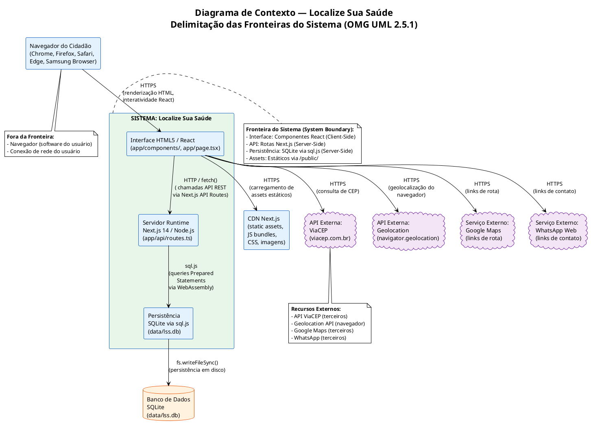
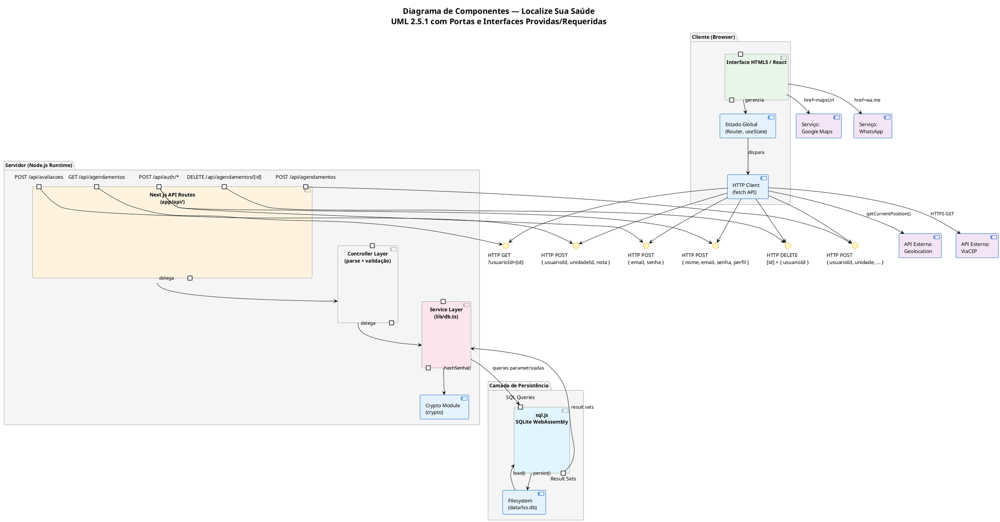
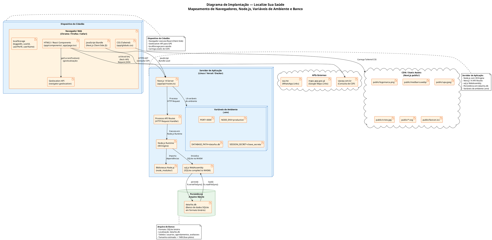
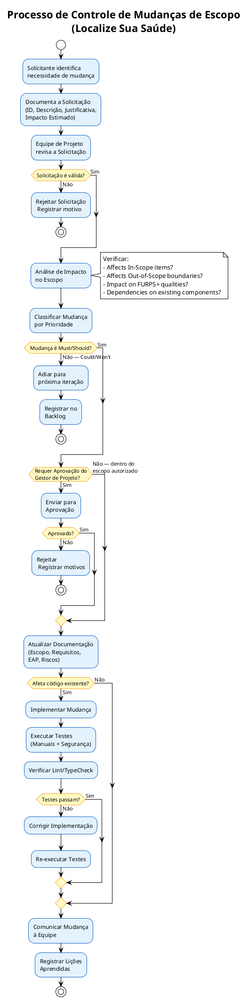

# Escopo do Projeto — Localize Sua Saúde

**Projeto:** Localize Sua Saúde (LSS)
**Stack Tecnológica:** Next.js 14 + React 18 + TypeScript + Tailwind CSS 4 + sql.js (SQLite WebAssembly)
**Versão do Documento:** 1.0.0
**Data:** 02/09/2026
**Padrões de Referência:** PMBOK 7ª Ed., OMG UML 2.5.1, ISO/IEC/IEEE 29148:2018

---

## Sumário

1. [Justificativa e Objetivos SMART](#1-justificativa-e-objetivos-smart)
2. [Delimitação das Fronteiras do Sistema](#2-delimitação-das-fronteiras-do-sistema)
3. [Escopo do Produto por Módulos](#3-escopo-do-produto-por-módulos)
4. [Diagrama de Componentes UML 2.5.1](#4-diagrama-de-componentes-uml-251)
5. [Diagrama de Implantação (Deployment)](#5-diagrama-de-implantação-deployment)
6. [Estrutura Analítica do Projeto (EAP / WBS)](#6-estrutura-analítica-do-projeto-eap--wbs)
7. [Limites do Projeto](#7-limites-do-projeto)
8. [Matrizes de Planejamento](#8-matrizes-de-planejamento)
9. [Governança e Controle de Mudanças](#9-governança-e-controle-de-mudanças)

---

## 1. Justificativa e Objetivos SMART

### 1.1 Justificativa de Engenharia

A região do Vale do Araguaia (Mato Grosso/GO) compreende municípios como Barra do Garças, Pontal do Araguaia e Aragarças, caracterizados por:

1. **Carência de informação centralizada** sobre unidades de saúde públicas e privadas.
2. **Necessidade da população** de acessar informações sobre disponibilidade de medicamentos em tempo real.
3. **Demanda por agendamento de consultas** que atualmente é feita presencialmente ou por telefone.
4. **Acesso limitado à internet** em algumas áreas rurais, exigindo uma solução leve e responsiva.
5. **Ausência de plataforma digital integrada** para o Vale do Araguaia na área de saúde.

A solução **Localize Sua Saúde** é uma plataforma web full-stack que centraliza:
- Busca e geolocalização de unidades de saúde
- Consulta de disponibilidade de medicamentos
- Agendamento e cancelamento de consultas
- Avaliação da qualidade dos serviços

### 1.2 Objetivos SMART

| Objetivo | SMART? | Especificação |
|---|---|---|
| **S** (Específico) | Sim | Criar uma plataforma web que permita aos cidadãos do Vale do Araguaia localizar unidades de saúde, consultar medicamentos, agendar consultas e avaliar serviços. |
| **M** (Mensurável) | Sim | O sistema deve ter ao menos: 5 rotas REST funcionais, 3 tabelas no banco de dados, 4 páginas públicas, 1 barra de acessibilidade, cobertura de 100% dos módulos: busca, cadastro, login, agendamento, avaliação. |
| **A** (Alcançável) | Sim | Utilizando stack Node.js + Next.js + React + SQLite (sem necessidade de infraestrutura externa de banco), a solução é viável com recursos de desenvolvimento estudantil/piloto. |
| **R** (Relevante) | Sim | Resolve problema real de acesso a informação de saúde na região, atendendo demanda social com impacto direto na qualidade de vida da população. |
| **T** (Temporal) | Sim | Fase piloto funcional em até 8 semanas de desenvolvimento. Lançamento beta em 12 semanas. |

### 1.3 Justificativa da Escolha da Stack Node.js + Next.js

| Critério | Justificativa |
|---|---|
| **Full-Stack Unificado** | Next.js permite frontend (React) e backend (API Routes) no mesmo projeto, reduzindo complexidade de deploy e manutenção. |
| **Server-Side Rendering** | Capacidade de renderizar páginas no servidor para SEO e performance em conexões lentas. |
| **SQLite via WebAssembly** | sql.js elimina a necessidade de servidor de banco de dados externo, simplificando deploy em ambientes de teste/piloto. |
| **Ecossistema React** | Comunidade ativa, bibliotecas abundantes, facilidade de encontrar desenvolvedores. |
| **TypeScript** | Tipagem estática reduz bugs em tempo de compilação, melhora manutenibilidade. |
| **Tailwind CSS** | Framework CSS utility-first que acelera desenvolvimento de interfaces responsivas. |

---

## 2. Delimitação das Fronteiras do Sistema

### 2.1 Diagrama de Contexto (System Context Diagram)



### 2.2 Descrição das Fronteiras

| Componente | Dentro da Fronteira | Fora da Fronteira | Interface |
|---|---|---|---|
| **Frontend (React/Next.js)** | Sim | — | Renderiza UI no browser, gerencia estado, envia requests HTTP |
| **Backend (Next.js API Routes)** | Sim | — | Processa requests, valida dados, acessa banco |
| **Persistência (SQLite)** | Sim | — | Armazena dados em arquivo `data/lss.db` |
| **Navegador do Usuário** | — | Sim | Executa JavaScript, renderiza HTML, fornece Geolocation API |
| **API ViaCEP** | — | Sim | Consulta de CEP → endereço (HTTP GET) |
| **Geolocation API** | — | Sim | Fornece latitude/longitude do dispositivo |
| **Google Maps** | — | Sim | Gera links de rota (não integrado diretamente, apenas links) |
| **WhatsApp Web** | — | Sim | Gera links `wa.me/` para contato |
| **CDN Next.js** | — | Sim | Serve assets estáticos (JS bundles, CSS, imagens) |
| **Banco de Dados SQLite** | Sim (via sql.js) | — | Persistência server-side em arquivo |

---

## 3. Escopo do Produto por Módulos

### 3.1 Módulo 1: Interface do Usuário (Frontend)

| Entregável | Arquivo(s) | Descrição | Status |
|---|---|---|---|
| Layout Raiz | `app/layout.tsx` | Layout global com `<html lang="pt-BR">`, Metadata SEO, inclusão de Header, Footer e AccessibilityBar | Implementado |
| Página Inicial | `app/page.tsx` | Busca textual, filtro por CEP, geolocalização, filtros avançados, links de acesso rápido | Implementado |
| Página de Hospitais | `app/hospitais/page.tsx` | Lista de unidades de saúde com filtros, ordenação, cards com informações detalhadas, sistema de avaliação | Implementado |
| Página de Medicamentos | `app/medicamentos/page.tsx` | Consulta de disponibilidade de medicamentos com busca e sugestões rápidas | Implementado |
| Página de Agendamento | `app/agendamento/page.tsx` | Formulário de agendamento com seleção de unidade, especialidade, data, horário; lista de agendamentos | Implementado |
| Página de Login | `app/login/page.tsx` | Formulário de autenticação com toggle de visibilidade de senha | Implementado |
| Página de Cadastro | `app/cadastro/page.tsx` | Formulário de registro com validação client-side e seleção de perfil | Implementado |
| Componente Header | `app/components/Header.tsx` | Barra de navegação com links: Início, Unidades, Medicamentos, Agendamento, Login | Implementado |
| Componente Footer | `app/components/Footer.tsx` | Rodapé com informações, links institucionais e legais (LGPD) | Implementado |
| Componente AccessibilityBar | `app/components/AccessibilityBar.tsx` | Barra de acessibilidade: Modo Idoso, Alto Contraste, A+/A- | Implementado |
| Estilos Globais | `app/globals.css` | CSS global com classes para layout, cards, formulários, responsividade | Implementado |

### 3.2 Módulo 2: API REST (Backend)

| Entregável | Arquivo(s) | Descrição | Status |
|---|---|---|---|
| Rota de Cadastro | `app/api/auth/cadastro/route.ts` | POST - Cadastro de novos usuários com validação | Implementado |
| Rota de Login | `app/api/auth/login/route.ts` | POST - Autenticação de usuários | Implementado |
| Rota de Agendamentos (CRUD) | `app/api/agendamentos/route.ts` | GET (listar por usuário) e POST (criar agendamento) | Implementado |
| Rota de Cancelamento | `app/api/agendamentos/[id]/route.ts` | DELETE - Cancelamento de agendamento por ID | Implementado |
| Rota de Avaliações | `app/api/avaliacoes/route.ts` | POST - Criação de avaliações de unidades | Implementado |

### 3.3 Módulo 3: Camada de Persistência

| Entregável | Arquivo(s) | Descrição | Status |
|---|---|---|---|
| Módulo de Banco de Dados | `lib/db.ts` | Camada completa de acesso a dados: inicialização SQLite, DDL, CRUD de usuários, agendamentos e avaliações | Implementado |
| Esquema DDL | (em `lib/db.ts` linhas 50-87) | Tabelas: `usuarios`, `agendamentos`, `avaliacoes` com constraints | Implementado |
| Funções de Serviço | `lib/db.ts` | `cadastrar()`, `autenticar()`, `criarAgendamento()`, `listarAgendamentosUsuario()`, `cancelarAgendamento()`, `criarAvaliacao()` | Implementado |
| Persistência em Disco | `lib/db.ts:persist()` | Função de serialização do banco SQLite para arquivo `data/lss.db` | Implementado |
| Diretório de Dados | `lib/db.ts:ensureDataDir()` | Criação automática do diretório `data/` | Implementado |
| Dados de Teste | `lib/db.ts` linhas 90-100 | Usuários padrão: cidadao@teste.com, atendente@teste.com, gestor@teste.com (senha: 123456) | Implementado |

### 3.4 Módulo 4: Configuração e Build

| Entregável | Arquivo(s) | Descrição | Status |
|---|---|---|---|
| Configuração do Projeto | `package.json` | Dependências, scripts (dev, build, start, lint) | Implementado |
| Configuração TypeScript | `tsconfig.json` | Configuração de compilação TypeScript | Implementado |
| Configuração ESLint | `eslint.config.mjs` | Regras de linting para Next.js | Implementado |
| Configuração PostCSS | `postcss.config.js`, `postcss.config.mjs` | Configuração para Tailwind CSS | Implementado |
| Configuração Next.js | `next.config.mjs` | Configurações do framework Next.js | Implementado |
| Git Ignore | `.gitignore` | Exclusão de node_modules, .next, data/, etc. | Implementado |

### 3.5 Módulo 5: Assets Estáticos

| Entregável | Arquivo(s) | Descrição | Status |
|---|---|---|---|
| Logomarca | `public/logomarca.png` | Logo do projeto Localize Sua Saúde | Implementado |
| Imagem Medbarra | `public/medbarra.webp` | Foto da unidade Medbarra | Implementado |
| Imagem UPA | `public/upa.jpeg` | Foto da UPA 24h | Implementado |
| Imagem Cristo Redentor | `public/cristo.jpg` | Foto do Hospital Cristo Redentor | Implementado |
| Ícones SVG | `public/*.svg` | Ícones globais (globe, file, window, next, vercel) | Implementado |
| Favicon | `app/favicon.ico` | Ícone da aba do navegador | Implementado |

### 3.6 Módulo 6: Documentação

| Entregável | Arquivo(s) | Descrição | Status |
|---|---|---|---|
| Requisitos de Usuário | `docs/requisitos_de_usuario.md` | Atores, casos de uso, RU, histórias de usuário, diagramas de sequência | Implementado |
| Requisitos de Sistema | `docs/requisitos_de_sistema.md` | RSF, RSNF, diagramas backend, DDL, contratos API | Implementado |
| Escopo do Projeto | `docs/escopo_do_projeto.md` | Este documento: escopo, EAP, riscos, governança | Implementado |
| Diagramas PlantUML | `docs/*.puml` | Diagramas de caso de uso, sequência, componentes, atividade, estado | Implementado |

---

## 4. Diagrama de Componentes UML 2.5.1



### 4.1 Descrição das Portas e Interfaces

| Componente | Porta (Interface) | Tipo | Direção | Descrição |
|---|---|---|---|---|
| **Interface HTML5** | `HTTP POST /api/auth/login` | Requerida | Saída | Envia credenciais de login para o servidor |
| **Interface HTML5** | `HTTP POST /api/auth/cadastro` | Requerida | Saída | Envia dados de cadastro para o servidor |
| **Interface HTML5** | `HTTP GET /api/agendamentos?usuarioId=` | Requerida | Saída | Solicita lista de agendamentos do usuário |
| **Interface HTML5** | `HTTP POST /api/agendamentos` | Requerida | Saída | Envia novo agendamento para o servidor |
| **Interface HTML5** | `HTTP DELETE /api/agendamentos/[id]` | Requerida | Saída | Solicita cancelamento de agendamento |
| **Interface HTML5** | `HTTP POST /api/avaliacoes` | Requerida | Saída | Envia avaliação de unidade de saúde |
| **Interface HTML5** | `HTTPS GET viacep.com.br/ws/{cep}/json/` | Requerida | Saída | Consulta de CEP via API externa |
| **Interface HTML5** | `navigator.geolocation.getCurrentPosition()` | Requerida | Saída | Obtém coordenadas GPS do dispositivo |
| **API Routes** | Parse + Validação de Request | Provida | Entrada | Recebe e valida payloads JSON |
| **Service Layer** | Prepared Statements SQL | Requerida | Saída | Executa queries parametrizadas no SQLite |
| **sql.js** | `db.run()`, `db.prepare()`, `stmt.bind()` | Provida | Saída | Interface de acesso ao SQLite via WebAssembly |
| **Filesystem** | `fs.writeFileSync()`, `fs.readFileSync()` | Requerida | Entrada/Saída | Persistência do banco em disco |

---

## 5. Diagrama de Implantação (Deployment Diagram)



### 5.1 Especificação dos Nós de Implantação

| Nó | Tipo | Tecnologia | Conteúdo | Recursos |
|---|---|---|---|---|
| **Dispositivo do Cidadão** | Device | Navegador Web | HTML5, CSS3, JavaScript (React) | CPU, Memória, Tela, GPS |
| **Servidor de Aplicação** | Server | Node.js 14+ / V8 Engine | Next.js 14, API Routes, sql.js | CPU, Memória, Disco, Rede |
| **Arquivo SQLite** | Database File | SQLite via WebAssembly | `data/lss.db` (binário) | Disco (escrita/leitura) |
| **CDN / Assets** | Cloud | Next.js `/public/` | Imagens, SVGs, Favicon | Rede (leitura) |
| **APIs Externas** | Cloud | HTTPS | ViaCEP, Google Maps, WhatsApp | Rede (somente leitura) |

### 5.2 Variáveis de Ambiente

| Variável | Tipo | Padrão | Descrição |
|---|---|---|---|
| `PORT` | `string` | `3000` | Porta TCP do servidor Next.js |
| `NODE_ENV` | `string` | `development` / `production` | Modo de execução do Node.js |
| `DATABASE_PATH` | `string` | `data/lss.db` | Caminho relativo para o arquivo SQLite |
| `SESSION_SECRET` | `string` | (chave secreta) | Chave para assinatura de tokens JWT (quando implementado) |

---

## 6. Estrutura Analítica do Projeto (EAP / WBS)

```
1.0 Localize Sua Saúde (LSS)
│
├── 1.1 Gerenciamento do Projeto
│   ├── 1.1.1 Plano de Projeto
│   │   ├── 1.1.1.1 Documento de Escopo (este documento)
│   │   ├── 1.1.1.2 Requisitos de Usuário
│   │   ├── 1.1.1.3 Requisitos de Sistema
│   │   └── 1.1.1.4 Cronograma de Entregas
│   ├── 1.1.2 Controle de Mudanças
│   │   ├── 1.1.2.1 Processo de Solicitação
│   │   ├── 1.1.2.2 Análise de Impacto
│   │   └── 1.1.2.3 Aprovação/Rejeição
│   └── 1.1.3 Comunicação
│       ├── 1.1.3.1 Documentação Técnica
│       └── 1.1.3.2 Diagramas PlantUML
│
├── 1.2 Arquitetura e Design
│   ├── 1.2.1 Definição de Arquitetura
│   │   ├── 1.2.1.1 Arquitetura Full-Stack (Next.js)
│   │   ├── 1.2.1.2 Padrão de Arquitetura (MVC / Service Layer)
│   │   └── 1.2.1.3 Decisões de Design (SQLite vs PostgreSQL)
│   ├── 1.2.2 Modelagem de Dados
│   │   ├── 1.2.2.1 Diagrama Entidade-Relacionamento
│   │   ├── 1.2.2.2 Esquema DDL (usuarios, agendamentos, avaliacoes)
│   │   └── 1.2.2.3 Constraints e Índices
│   └── 1.2.3 Diagramas UML
│       ├── 1.2.3.1 Diagrama de Casos de Uso
│       ├── 1.2.3.2 Diagrama de Sequência
│       ├── 1.2.3.3 Diagrama de Componentes
│       ├── 1.2.3.4 Diagrama de Implantação
│       └── 1.2.3.5 Diagrama de Estados
│
├── 1.3 Desenvolvimento Frontend
│   ├── 1.3.1 Configuração do Projeto
│   │   ├── 1.3.1.1 package.json (dependências)
│   │   ├── 1.3.1.2 tsconfig.json (TypeScript)
│   │   ├── 1.3.1.3 next.config.mjs (Next.js)
│   │   ├── 1.3.1.4 postcss.config.js (Tailwind)
│   │   └── 1.3.1.5 eslint.config.mjs (ESLint)
│   ├── 1.3.2 Layout e Componentes Globais
│   │   ├── 1.3.2.1 app/layout.tsx (Layout raiz)
│   │   ├── 1.3.2.2 app/components/Header.tsx (Navegação)
│   │   ├── 1.3.2.3 app/components/Footer.tsx (Rodapé)
│   │   ├── 1.3.2.4 app/components/AccessibilityBar.tsx (Acessibilidade)
│   │   └── 1.3.2.5 app/globals.css (Estilos globais)
│   ├── 1.3.3 Páginas Públicas
│   │   ├── 1.3.3.1 app/page.tsx (Página inicial / busca)
│   │   ├── 1.3.3.2 app/hospitais/page.tsx (Lista de unidades)
│   │   ├── 1.3.3.3 app/medicamentos/page.tsx (Consulta medicamentos)
│   │   └── 1.3.3.4 Imagens em public/ (logomarca, fotos das unidades)
│   ├── 1.3.4 Páginas Autenticadas
│   │   ├── 1.3.4.1 app/login/page.tsx (Formulário de login)
│   │   ├── 1.3.4.2 app/cadastro/page.tsx (Formulário de cadastro)
│   │   └── 1.3.4.3 app/agendamento/page.tsx (Agendamento de consultas)
│   └── 1.3.5 Assets Estáticos
│       ├── 1.3.5.1 public/logomarca.png
│       ├── 1.3.5.2 public/medbarra.webp
│       ├── 1.3.5.3 public/upa.jpeg
│       ├── 1.3.5.4 public/cristo.jpg
│       ├── 1.3.5.5 public/favicon.ico
│       └── 1.3.5.6 public/*.svg
│
├── 1.4 Desenvolvimento Backend
│   ├── 1.4.1 API Routes (Next.js)
│   │   ├── 1.4.1.1 app/api/auth/cadastro/route.ts
│   │   ├── 1.4.1.2 app/api/auth/login/route.ts
│   │   ├── 1.4.1.3 app/api/agendamentos/route.ts
│   │   ├── 1.4.1.4 app/api/agendamentos/[id]/route.ts
│   │   └── 1.4.1.5 app/api/avaliacoes/route.ts
│   └── 1.4.2 Camada de Serviço
│       ├── 1.4.2.1 lib/db.ts (Módulo de banco de dados)
│       │   ├── 1.4.2.1.1 Inicialização SQLite (sql.js)
│       │   ├── 1.4.2.1.2 Schema DDL (CREATE TABLE IF NOT EXISTS)
│       │   ├── 1.4.2.1.3 Função hashSenha() (SHA-256)
│       │   ├── 1.4.2.1.4 Função cadastrar()
│       │   ├── 1.4.2.1.5 Função autenticar()
│       │   ├── 1.4.2.1.6 Função criarAgendamento()
│       │   ├── 1.4.2.1.7 Função listarAgendamentosUsuario()
│       │   ├── 1.4.2.1.8 Função cancelarAgendamento()
│       │   ├── 1.4.2.1.9 Função criarAvaliacao()
│       │   └── 1.4.2.1.10 Função persist() (escrita em disco)
│       └── 1.4.2.2 Dados de teste (usuários padrão)
│
├── 1.5 Banco de Dados
│   ├── 1.5.1 Esquema
│   │   ├── 1.5.1.1 Tabela: usuarios
│   │   ├── 1.5.1.2 Tabela: agendamentos
│   │   └── 1.5.1.3 Tabela: avaliacoes
│   ├── 1.5.2 Constraints
│   │   ├── 1.5.2.1 PRIMARY KEY (AUTOINCREMENT)
│   │   ├── 1.5.2.2 FOREIGN KEY (usuario_id)
│   │   ├── 1.5.2.3 UNIQUE (email)
│   │   └── 1.5.2.4 CHECK (nota BETWEEN 1 AND 5)
│   └── 1.5.3 Persistência
│       ├── 1.5.3.1 Arquivo: data/lss.db
│       ├── 1.5.3.2 Diretório: data/ (auto-criado)
│       └── 1.5.3.3 Usuários de teste (INSERT OR IGNORE)
│
├── 1.6 Segurança
│   ├── 1.6.1 Criptografia de Senhas
│   │   └── 1.6.1.1 SHA-256 (implementação atual)
│   ├── 1.6.2 Autenticação
│   │   └── 1.6.2.1 localStorage (implementação atual)
│   ├── 1.6.3 Proteção contra Injeção
│   │   ├── 1.6.3.1 Prepared Statements (SQL Injection)
│   │   └── 1.6.3.2 React escaping (XSS)
│   └── 1.6.4 Validação de Entradas
│       ├── 1.6.4.1 Server-side (regex email, tamanho senha)
│       └── 1.6.4.2 Client-side (campos obrigatórios, senhas coincidentes)
│
├── 1.7 Testes
│   ├── 1.7.1 Testes Manuais
│   │   ├── 1.7.1.1 Cadastro de usuário
│   │   ├── 1.7.1.2 Login e autenticação
│   │   ├── 1.7.1.3 Busca de unidades
│   │   ├── 1.7.1.4 Agendamento de consulta
│   │   ├── 1.7.1.5 Cancelamento de agendamento
│   │   └── 1.7.1.6 Avaliação de unidade
│   └── 1.7.2 Testes de Segurança
│       ├── 1.7.2.1 SQL Injection
│       ├── 1.7.2.2 XSS Refletido
│       └── 1.7.2.3 Bypass de Autenticação
│
└── 1.8 Documentação
    ├── 1.8.1 docs/requisitos_de_usuario.md
    ├── 1.8.2 docs/requisitos_de_sistema.md
    ├── 1.8.3 docs/escopo_do_projeto.md
    ├── 1.8.4 docs/diagrama_casos_uso.puml
    ├── 1.8.5 docs/diagrama_sequencia_login.puml
    ├── 1.8.6 docs/diagrama_sequencia_agendamento.puml
    ├── 1.8.7 docs/diagrama_componentes.puml
    ├── 1.8.8 docs/diagrama_estado_agendamento.puml
    └── 1.8.9 docs/diagrama_atividade_agendamento.puml
```

### 6.1 Dicionário de Entregáveis

| Código | Entregável | Tipo | Responsável | Dependências |
|---|---|---|---|---|
| 1.1.1 | Plano de Projeto | Documento | Gerente de Projeto | — |
| 1.2.1 | Arquitetura | Documento | Arquiteto de Software | 1.1.1 |
| 1.2.2 | Modelagem de Dados | Documento + DDL | Arquiteto de Dados | 1.2.1 |
| 1.3.1 | Configuração do Projeto | Config | Desenvolvedor | 1.2.1 |
| 1.3.2 | Layout e Componentes | Código React | Desenvolvedor Frontend | 1.3.1 |
| 1.3.3 | Páginas Públicas | Código React | Desenvolvedor Frontend | 1.3.2 |
| 1.3.4 | Páginas Autenticadas | Código React | Desenvolvedor Frontend | 1.3.2, 1.4.1 |
| 1.4.1 | API Routes | Código TypeScript | Desenvolvedor Backend | 1.2.2, 1.4.2 |
| 1.4.2 | Camada de Serviço | Código TypeScript | Desenvolvedor Backend | 1.2.2 |
| 1.5.1 | Esquema DDL | SQL | Engenheiro de Dados | 1.2.2 |
| 1.6.1 | Segurança | Implementação | Engenheiro de Segurança | 1.4.2 |
| 1.7.1 | Testes | Plano + Evidências | Analista de QA | 1.3.*, 1.4.* |
| 1.8.* | Documentação | Documento | Technical Writer | Todos os anteriores |

---

## 7. Limites do Projeto

### 7.1 Dentro do Escopo (In-Scope)

| # | Item | Descrição |
|---|---|---|
| IS-01 | **Interface Web Responsiva** | Páginas HTML5/React com Tailwind CSS funcionando em mobile, tablet e desktop |
| IS-02 | **Busca de Unidades de Saúde** | Busca textual, filtros por cidade, tipo, atendimento e especialidade |
| IS-03 | **Busca por CEP** | Integração com API ViaCEP para busca geográfica por CEP |
| IS-04 | **Geolocalização** | Utilização da API Geolocation do navegador para busca por GPS |
| IS-05 | **Cadastro de Usuários** | Formulário de registro com validação client-side e server-side |
| IS-06 | **Autenticação de Usuários** | Login com e-mail e senha, persistência de sessão em localStorage |
| IS-07 | **Perfis de Acesso** | Três perfis: cidadao, atendente, gestor (controle básico) |
| IS-08 | **Agendamento de Consultas** | Formulário completo: unidade, especialidade, data, horário, paciente |
| IS-09 | **Cancelamento de Agendamentos** | Cancelamento com confirmação, soft delete (status alterado) |
| IS-10 | **Avaliação de Unidades** | Sistema de notas (1-5 estrelas) e comentários |
| IS-11 | **Consulta de Medicamentos** | Busca de disponibilidade por medicamento (dados estáticos) |
| IS-12 | **Acessibilidade** | Barra de acessibilidade: Modo Idoso, Alto Contraste, A+/A- |
| IS-13 | **Persistência SQLite** | Banco de dados relacional via sql.js com persistência em arquivo |
| IS-14 | **Sanitização de Entradas** | Prepared Statements (SQL Injection), React escaping (XSS) |
| IS-15 | **Documentação Técnica** | Requisitos, escopo, diagramas UML em PlantUML |
| IS-16 | **Dados de Teste** | Usuários padrão para demonstração (cidadao, atendente, gestor) |
| IS-17 | **Imagens das Unidades** | Fotos de Medbarra, UPA 24h, Hospital Cristo Redentor |
| IS-18 | **Links de Contato** | Botões de ligação telefônica e WhatsApp para cada unidade |
| IS-19 | **Links de Rota** | Integração com Google Maps para geração de rotas |

### 7.2 Fora do Escopo (Out-of-Scope)

| # | Item | Justificativa da Exclusão | Risco de Inclusão |
|---|---|---|---|
| OS-01 | **Aplicativo Mobile Nativo** (iOS/Android) | A solução é web-first; um app nativo requer equipe especializada em Swift/Kotlin e processo de publicação nas lojas | Escopo massivamente expandido, custo e tempo exponenciais |
| OS-02 | **Sistema de Pagamentos** | O projeto é gratuito para a população; não há necessidade de integração com gateways de pagamento | Complexidade regulatória (PCI-DSS), custos de transação |
| OS-03 | **Chat em Tempo Real** | Não há necessidade de comunicação síncrona entre usuários | Requer WebSocket/SSE, infraestrutura de mensageria |
| OS-04 | **Sistema de Notificações Push** | Não há necessidade de notificações proativas | Requer Service Workers, permissões do navegador, infraestrutura |
| OS-05 | **Integração com CNES/DATASUS** | Dados oficiais do Ministério da Saúde; requer API pública que pode não existir ou ter restrições | Dependência de API governamental instável |
| OS-06 | **Telemedicina/Videochamadas** | Funcionalidade de alto impacto que demanda infraestrutura de streaming | Custo de infraestrutura, latência, regulamentação CRM |
| OS-07 | **Prontuário Eletrônico (PEP)** | Sistema complexo com regulamentação própria (ANS, CFM) | Alto risco regulatório, necessidade de conformidade com normas |
| OS-08 | **Sistema de Faturamento/TISS** | Faturamento de convênios médicos requer conformidade com TISS | Complexidade regulatória, integração com operadoras |
| OS-09 | **Multi-idioma (Internacionalização)** | O público-alvo é exclusivamente brasileiro (Vale do Araguaia) | Esforço desnecessário para o escopo atual |
| OS-10 | **Testes Automatizados (Unit/E2E)** | Fase piloto; testes automatizados podem ser adicionados em iterações futuras | Risco de regressão; deve ser priorizado em versão 2.0 |
| OS-11 | **CI/CD Pipeline** | Deploy manual; pipeline de integração contínua pode ser adicionado futuramente | Risco de deploy manual com erros |
| OS-12 | **Rate Limiting / Throttling** | Proteção contra abuso; não implementado na fase piloto | Risco de DDoS em produção |
| OS-13 | **Logging Estruturado** | Sistema de logs para monitoramento; não implementado na fase piloto | Dificuldade de diagnóstico em produção |
| OS-14 | **Backup Automático** | Backup manual do arquivo `data/lss.db`; automação pode ser adicionada futuramente | Risco de perda de dados |
| OS-15 | **Migração para PostgreSQL** | Atualmente usa SQLite via sql.js; migração para PostgreSQL em produção requer refatoração | Requer configuração de servidor de banco separado |
| OS-16 | **Autenticação JWT** | Atualmente usa localStorage; implementação JWT é recomendada mas fora do escopo piloto | Risco de segurança (spoofing de sessão) |

---

## 8. Matrizes de Planejamento

### 8.1 Matriz de Critérios de Aceitação (CA)

| ID | Critério de Aceitação | Modo de Verificação | Prioridade | Status |
|---|---|---|---|---|
| CA-01 | O cidadão consegue buscar unidades de saúde por texto e filtros | Teste manual na página inicial | Must | Aprovado |
| CA-02 | A busca por CEP consulta a API ViaCEP e exibe o endereço | Teste manual com CEP 78620000 | Must | Aprovado |
| CA-03 | A geolocalização obtém coordenadas e redireciona para hospitais | Teste manual com GPS habilitado | Should | Aprovado |
| CA-04 | O cadastro valida campos, email, senhas e termos client-side | Teste com dados inválidos | Must | Aprovado |
| CA-05 | O cadastro rejeita emails duplicados | Teste com cidadao@teste.com (já existente) | Must | Aprovado |
| CA-06 | O login autentica com credenciais válidas | Teste com cidadao@teste.com / 123456 | Must | Aprovado |
| CA-07 | O login rejeita credenciais inválidas | Teste com email/senha incorretos | Must | Aprovado |
| CA-08 | O agendamento requer autenticação prévia | Teste sem estar logado | Must | Aprovado |
| CA-09 | O agendamento persiste no SQLite com status "confirmado" | Verificar banco de dados | Must | Aprovado |
| CA-10 | O cancelamento altera status para "cancelado" | Verificar banco de dados | Must | Aprovado |
| CA-11 | A avaliação persiste com nota 1-5 | Teste com nota inválida | Should | Aprovado |
| CA-12 | A barra de acessibilidade altera modo idoso e contraste | Teste manual | Must | Aprovado |
| CA-13 | As preferências de acessibilidade persistem em localStorage | Recarregar página e verificar | Should | Aprovado |
| CA-14 | A página funciona em resolução 320px (mobile) | Teste com DevTools responsive | Must | Aprovado |
| CA-15 | Queries SQL usam Prepared Statements | Revisão de código em lib/db.ts | Must | Aprovado |
| CA-16 | Senhas são armazenadas como hash (não texto plano) | Verificar banco de dados | Must | Aprovado |
| CA-17 | Usuários de teste são criados automaticamente | Verificar INSERT OR IGNORE no startup | Must | Aprovado |
| CA-18 | O banco de dados persiste em arquivo data/lss.db | Reiniciar servidor e verificar dados | Must | Aprovado |

### 8.2 Matriz de Restrições e Premissas

| ID | Tipo | Descrição | Impacto | Mitigação |
|---|---|---|---|---|
| RP-01 | **Restrição** | O sistema deve funcionar sem servidor de banco de dados externo (SQLite embutido) | Limita escalabilidade; banco é single-file | Planejar migração para PostgreSQL em fase de produção |
| RP-02 | **Restrição** | O sistema deve ser acessível em conexões lentas (típicas da região) | Limita uso de frameworks pesados | Next.js com code splitting, imagens otimizadas, Tailwind CSS |
| RP-03 | **Restrição** | A solução deve atender WCAG 2.1 nível AA | Aumenta esforço de desenvolvimento | AccessibilityBar, aria-*, roles semânticos |
| RP-04 | **Restrição** | Não há orçamento para infraestrutura de cloud na fase piloto | Limita deploy a ambiente local | Deploy local ou Vercel (free tier) |
| RP-05 | **Premissa** | Os cidadãos possuem acesso a智能手机 com navegador moderno | Se não verdadeiro, sistema inacessível | Manter compatibilidade com navegadores antigos via polyfills |
| RP-06 | **Premissa** | A API ViaCEP permanece disponível e gratuita | Se indisponível, busca por CEP falha | Fallback para mensagem de erro e sugestão de usar geolocalização |
| RP-07 | **Premissa** | As unidades de saúde fornecerão dados atualizados de medicamentos | Se não, dados ficam desatualizados | Interface de cadastro para atendentes (futuro) |
| RP-08 | **Premissa** | O desenvolvimento será feito por equipe de 1-2 desenvolvedores | Limita velocidade de entrega | Priorizar funcionalidades essenciais (Must) |
| RP-09 | **Premissa** | O deploy será em ambiente de teste/piloto (não produção pública) | Limita requisitos de segurança | Planejar hardening para produção futura |
| RP-10 | **Premissa** | O público-alvo fala português brasileiro | Não há necessidade de internacionalização | Manter `lang="pt-BR"` no HTML |

### 8.3 Matriz de Riscos Técnicos com Planos de Mitigação

| ID | Risco | Probabilidade | Impacto | Nível | Plano de Mitigação Arquitetural |
|---|---|---|---|---|---|
| RT-01 | **Event Loop Blocking** — Operações síncronas pesadas no Node.js bloqueiam o event loop | Média | Alto | **Alto** | 1. sql.js opera com operações WebAssembly (rápidas mas síncronas no contexto WASM). 2. Para produção: migrar para better-sqlite3 (nativo) ou PostgreSQL com driver async (pg). 3. Monitorar tempo de resposta das rotas. 4. Evitar operações de filesystem pesadas em handlers de request. |
| RT-02 | **Injeção de SQL** — Payloads maliciosos em campos de entrada | Baixa | Crítico | **Alto** | 1. **Já mitigado**: Todas as queries usam Prepared Statements (`db.prepare()` + `stmt.bind()`). 2. Nenhuma concatenação de strings em queries SQL. 3. Validação server-side de todos os inputs. 4. Testes periódicos com payloads SQLi (`' OR '1'='1`). |
| RT-03 | **Injeção de XSS** — Scripts maliciosos injetados em campos de entrada | Baixa | Alto | **Médio** | 1. **Já mitigado**: React escapa automaticamente todo conteúdo JSX. 2. Nenhum uso de `dangerouslySetInnerHTML`. 3. `rel="noopener noreferrer"` em links externos. 4. Para defesa em profundidade: adicionar DOMPurify server-side. |
| RT-04 | **Perda de Dados** — Corrupção ou perda do arquivo SQLite | Média | Alto | **Alto** | 1. `persist(db)` chamado após cada operação de escrita. 2. **Recomendação**: Implementar backup automático periódico (cron job). 3. **Recomendação**: Migrar para PostgreSQL com backup automático em produção. 4. Manter cópia de segurança do arquivo `data/lss.db`. |
| RT-05 | **Bypass de Autenticação** — Manipulação de localStorage pelo cliente | Alta | Crítico | **Crítico** | 1. **Vulnerabilidade conhecida**: localStorage pode ser manipulado. 2. **Mitigação recomendada**: Implementar JWT com cookie HTTP-Only. 3. Middleware server-side verificando token em cada rota protegida. 4. Para fase piloto: aceitar risco com notificação na documentação. |
| RT-06 | **Escalabilidade do SQLite** — Muitos写 concurrentes | Baixa | Médio | **Baixo** | 1. Para fase piloto (poucos usuários): SQLite é suficiente. 2. sql.js não suporta concorrência de escrita (single-writer). 3. **Recomendação**: Migrar para PostgreSQL com connection pooling em produção. |
| RT-07 | **Indisponibilidade da API ViaCEP** — Serviço externo fora do ar | Média | Baixo | **Baixo** | 1. Tratamento de erro com mensagem amigável. 2. Fallback para busca por geolocalização ou entrada manual. 3. Cache de respostas anteriores (localStorage). |
| RT-08 | **Tamanho do Bundle JS** — Bundle grande lenta em conexões lentas | Média | Médio | **Médio** | 1. Next.js code splitting automático por rota. 2. Componentes `'use client'` apenas quando necessário. 3. Imagens otimizadas via `next/image`. 4. Monitorar bundle size com @next/bundle-analyzer. |
| RT-09 | **Vulnerabilidade de Senhas** — SHA-256 sem salt é fraco | Alta | Crítico | **Crítico** | 1. **Vulnerabilidade conhecida**: SHA-256 sem salt. 2. **Mitigação obrigatória**: Migrar para bcrypt (12 rounds) ou argon2id antes de produção. 3. OWASP Password Storage Cheat Sheet como referência. |
| RT-10 | **Memory Leak no sql.js** — Instância SQLite acumulando memória | Baixa | Médio | **Baixo** | 1. Singleton com `_db` global (evita múltiplas instâncias). 2. `stmt.free()` chamado após cada operação prepare/step. 3. Monitorar uso de memória do processo Node.js. |

---

## 9. Governança e Processo de Controle de Mudanças

### 9.1 Processo de Controle de Mudanças



### 9.2 Regras de Governança

| Regra | Descrição |
|---|---|
| **G-01** | Toda mudança de escopo deve ser documentada por escrito antes da implementação. |
| **G-02** | Mudanças classificadas como "Out-of-Scope" (OS-01 a OS-16) requerem aprovação formal do Gestor de Projeto. |
| **G-03** | Mudanças que afetam segurança (RSNF-S*) devem ser revisadas por Engenheiro de Segurança. |
| **G-04** | Mudanças que afetam o DDL do banco de dados requerem script de migração e rollback. |
| **G-05** | Toda implementação deve passar por verificação de lint (`npm run lint`) e typecheck antes de commit. |
| **G-06** | Mudanças em produção requerem deploy controlado com possibility de rollback. |
| **G-07** | Reuniões de revisão de escopo devem ocorrer ao menos quinzenalmente durante o desenvolvimento. |
| **G-08** | Novos requisitos identificados após o baseline devem ser registrados no backlog com priorização MoSCoW. |

### 9.3 Critérios de Aceite para Encerramento do Projeto

| Critério | Descrição | Status |
|---|---|---|
| **EA-01** | Todas as funcionalidades "Must" implementadas e testadas | Em andamento |
| **EA-02** | Documentação técnica completa (requisitos, escopo, diagramas) | Em andamento |
| **EA-03** | Banco de dados funcional com persistência verificada | Implementado |
| **EA-04** | Barra de acessibilidade funcional (Modo Idoso, Alto Contraste, A+/A-) | Implementado |
| **EA-05** | Páginas responsivas testadas em 320px, 768px e 1024px+ | Implementado |
| **EA-06** | Prepared Statements verificados em todas as queries SQL | Implementado |
| **EA-07** | Usuários de teste criados automaticamente no startup | Implementado |
| **EA-08** | Nenhum vulnerabilidade de SQL Injection ou XSS identificada | Implementado |
| **EA-09** | Deploy funcional em ambiente de teste | Pendente |
| **EA-10** | Aprovação formal do Gestor de Projeto | Pendente |

---

**Fim do Documento — Escopo do Projeto v1.0.0**
