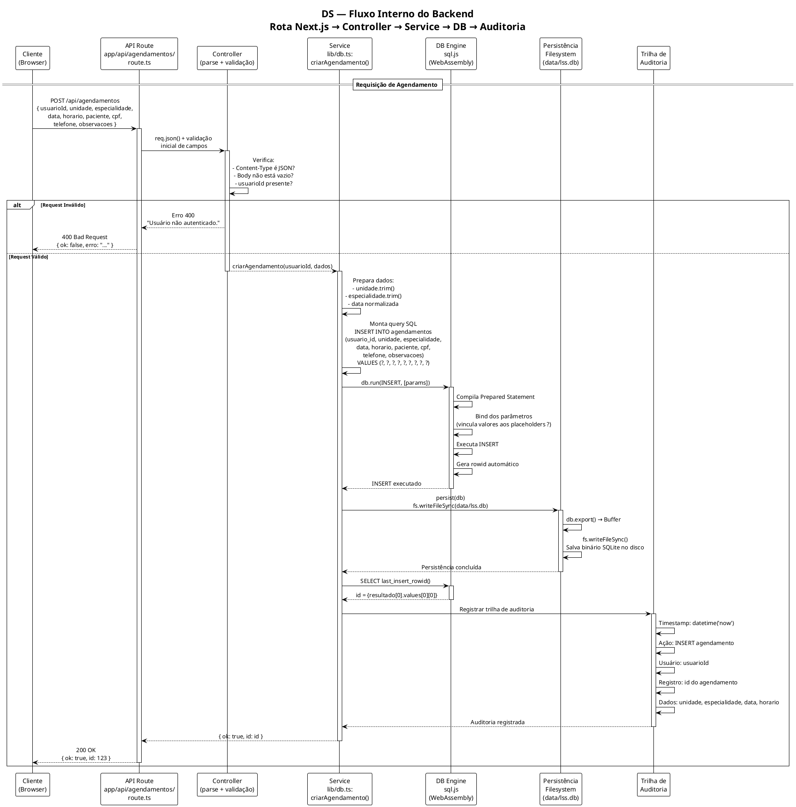
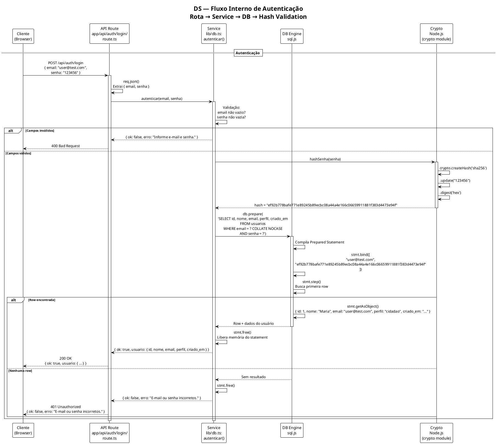
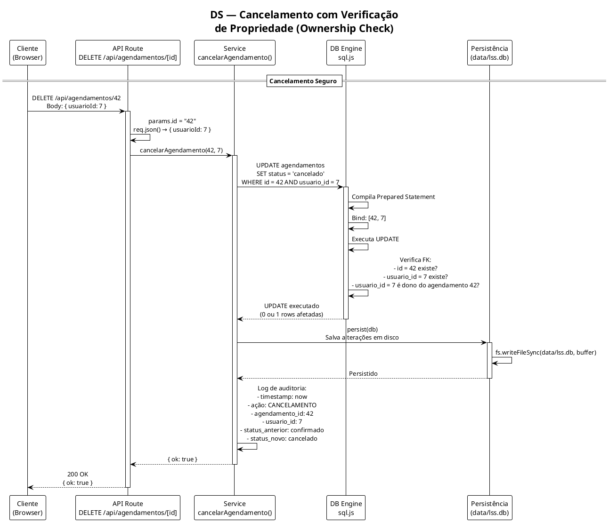
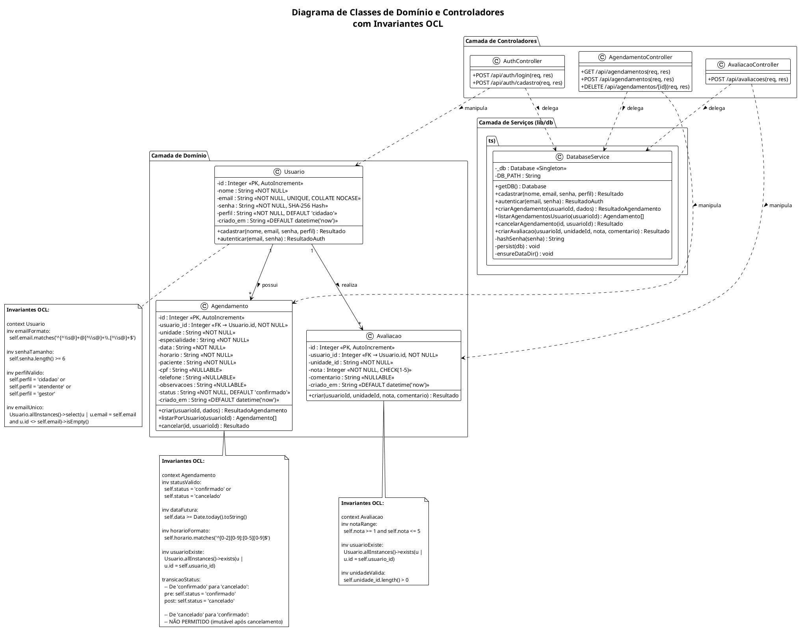
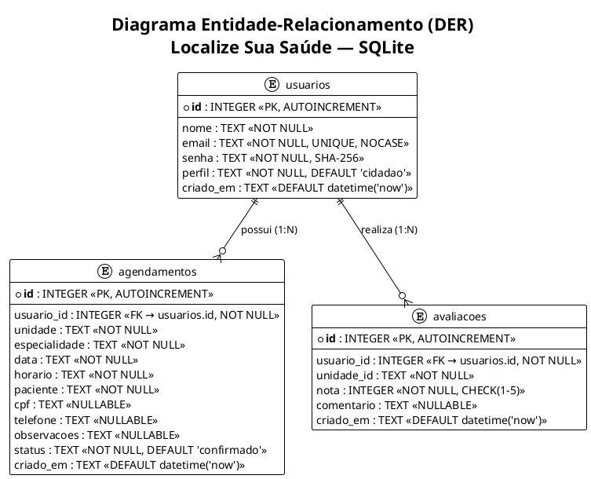

# Requisitos de Sistema — Localize Sua Saúde

**Projeto:** Localize Sua Saúde (LSS)
**Stack Tecnológica:** Next.js 14 (React 18) + TypeScript + Tailwind CSS 4 + sql.js (SQLite WebAssembly)
**Versão do Documento:** 1.0.0
**Data:** 02/09/2026
**Padrões de Referência:** OMG UML 2.5.1, ISO/IEC/IEEE 29148:2018, FURPS+ / ISO/IEC 25010

---

## Sumário

1. [Requisitos Funcionais de Sistema (RSF)](#1-requisitos-funcionais-de-sistema-rsf)
2. [Requisitos Não Funcionais (RSNF)](#2-requisitos-não-funcionais-rsnf)
3. [Diagramas de Sequência de Backend](#3-diagramas-de-sequência-de-backend)
4. [Diagrama Estrutural de Classes de Domínio](#4-diagrama-estrutural-de-classes-de-domínio)
5. [Dicionário Técnico de Dados](#5-dicionário-técnico-de-dados)
6. [Contratos de API RESTful](#6-contratos-de-api-restful)
7. [Matriz de Rastreabilidade Técnica](#7-matrizes-de-rastreabilidade-técnica)

---

## 1. Requisitos Funcionais de Sistema (RSF)

### RSF-001: Serviço de Autenticação de Usuários

| Campo | Valor |
|---|---|
| **Identificador** | RSF-001 |
| **Rota HTTP** | `POST /api/auth/login` |
| **Método HTTP** | POST |
| **Content-Type** | `application/json` |
| **Payload (Request)** | `{ "email": string, "senha": string }` |
| **Código de Status (Sucesso)** | `200 OK` |
| **Código de Status (Falha)** | `401 Unauthorized`, `400 Bad Request`, `500 Internal Server Error` |
| **Response (Sucesso)** | `{ "ok": true, "usuario": { "id": number, "nome": string, "email": string, "perfil": string, "criado_em": string } }` |
| **Response (Falha)** | `{ "ok": false, "erro": string }` |
| **Middlewares Exigidos** | Nenhum middleware de autenticação (rota pública). |
| **Lógica de Negócio** | 1. Validação de campos obrigatórios (email, senha não vazios). 2. Hash SHA-256 da senha fornecida. 3. Query parametrizada: `SELECT id, nome, email, perfil, criado_em FROM usuarios WHERE email = ? COLLATE NOCASE AND senha = ?`. 4. Se resultado vazio → 401. Se encontrado → retorna dados do usuário. |
| **Arquivo de Implementação** | `app/api/auth/login/route.ts` |
| **Função de Negócio** | `lib/db.ts:autenticar()` |

### RSF-002: Serviço de Cadastro de Usuários

| Campo | Valor |
|---|---|
| **Identificador** | RSF-002 |
| **Rota HTTP** | `POST /api/auth/cadastro` |
| **Método HTTP** | POST |
| **Content-Type** | `application/json` |
| **Payload (Request)** | `{ "nome": string, "email": string, "senha": string, "perfil": "cidadao" \| "atendente" \| "gestor" }` |
| **Código de Status (Sucesso)** | `200 OK` |
| **Código de Status (Falha)** | `400 Bad Request`, `500 Internal Server Error` |
| **Response (Sucesso)** | `{ "ok": true }` |
| **Response (Falha)** | `{ "ok": false, "erro": string }` |
| **Middlewares Exigidos** | Nenhum (rota pública). |
| **Lógica de Negócio** | 1. Validação server-side: nome não vazio, email formato válido (`/^[^\s@]+@[^\s@]+\.[^\s@]+$/`), senha >= 6 caracteres. 2. Normalização: `nome.trim()`, `email.trim().toLowerCase()`. 3. Hash SHA-256 da senha. 4. INSERT parametrizado: `INSERT INTO usuarios (nome, email, senha, perfil) VALUES (?, ?, ?, ?)`. 5. Tratamento de constraint UNIQUE no email. |
| **Arquivo de Implementação** | `app/api/auth/cadastro/route.ts` |
| **Função de Negócio** | `lib/db.ts:cadastrar()` |

### RSF-003: Serviço de Listagem de Agendamentos por Usuário

| Campo | Valor |
|---|---|
| **Identificador** | RSF-003 |
| **Rota HTTP** | `GET /api/agendamentos` |
| **Método HTTP** | GET |
| **Query Parameters** | `usuarioId` (obrigatório) |
| **Payload (Request)** | N/A (query string) |
| **Código de Status (Sucesso)** | `200 OK` |
| **Código de Status (Falha)** | `400 Bad Request` (usuarioId ausente) |
| **Response (Sucesso)** | `{ "ok": true, "agendamentos": [ { "id": number, "usuario_id": number, "unidade": string, "especialidade": string, "data": string, "horario": string, "paciente": string, "cpf": string \| null, "telefone": string \| null, "observacoes": string \| null, "status": string, "criado_em": string } ] }` |
| **Response (Falha)** | `{ "ok": false, "erro": "usuarioId obrigatório" }` |
| **Lógica de Negócio** | 1. Extração do parâmetro `usuarioId` de `req.nextUrl.searchParams`. 2. Validação: usuarioId não nulo. 3. Query parametrizada: `SELECT * FROM agendamentos WHERE usuario_id = ? ORDER BY data DESC, horario DESC`. |
| **Arquivo de Implementação** | `app/api/agendamentos/route.ts` |
| **Função de Negócio** | `lib/db.ts:listarAgendamentosUsuario()` |

### RSF-004: Serviço de Criação de Agendamentos

| Campo | Valor |
|---|---|
| **Identificador** | RSF-004 |
| **Rota HTTP** | `POST /api/agendamentos` |
| **Método HTTP** | POST |
| **Content-Type** | `application/json` |
| **Payload (Request)** | `{ "usuarioId": number, "unidade": string, "especialidade": string, "data": string, "horario": string, "paciente": string, "cpf"?: string, "telefone"?: string, "observacoes"?: string }` |
| **Código de Status (Sucesso)** | `200 OK` |
| **Código de Status (Falha)** | `400 Bad Request`, `401 Unauthorized`, `500 Internal Server Error` |
| **Response (Sucesso)** | `{ "ok": true, "id": number }` |
| **Response (Falha)** | `{ "ok": false, "erro": string }` |
| **Lógica de Negócio** | 1. Extração do `usuarioId` do body. 2. Validação: usuarioId não nulo. 3. INSERT parametrizado com 9 colunas (usuario_id, unidade, especialidade, data, horario, paciente, cpf, telefone, observacoes). 4. Campos opcionais (cpf, telefone, observacoes) são inseridos como NULL. 5. Recuperação do último ID inserido via `SELECT last_insert_rowid()`. 6. Persistência em disco via `persist(db)`. |
| **Arquivo de Implementação** | `app/api/agendamentos/route.ts` |
| **Função de Negócio** | `lib/db.ts:criarAgendamento()` |

### RSF-005: Serviço de Cancelamento de Agendamentos

| Campo | Valor |
|---|---|
| **Identificador** | RSF-005 |
| **Rota HTTP** | `DELETE /api/agendamentos/[id]` |
| **Método HTTP** | DELETE |
| **Parâmetro de Rota** | `id` (número inteiro) |
| **Payload (Request)** | `{ "usuarioId": number }` |
| **Código de Status (Sucesso)** | `200 OK` |
| **Código de Status (Falha)** | `500 Internal Server Error` |
| **Response (Sucesso)** | `{ "ok": true }` |
| **Response (Falha)** | `{ "ok": false, "erro": string }` |
| **Lógica de Negócio** | 1. Extração do `id` da URL params. 2. Extração do `usuarioId` do body. 3. UPDATE parametrizado: `UPDATE agendamentos SET status = 'cancelado' WHERE id = ? AND usuario_id = ?`. 4. Soft delete: registro permanece no banco com status alterado. 5. Persistência em disco. |
| **Arquivo de Implementação** | `app/api/agendamentos/[id]/route.ts` |
| **Função de Negócio** | `lib/db.ts:cancelarAgendamento()` |

### RSF-006: Serviço de Criação de Avaliações

| Campo | Valor |
|---|---|
| **Identificador** | RSF-006 |
| **Rota HTTP** | `POST /api/avaliacoes` |
| **Método HTTP** | POST |
| **Content-Type** | `application/json` |
| **Payload (Request)** | `{ "usuarioId": number, "unidadeId": string, "nota": number, "comentario"?: string }` |
| **Código de Status (Sucesso)** | `200 OK` |
| **Código de Status (Falha)** | `401 Unauthorized`, `500 Internal Server Error` |
| **Response (Sucesso)** | `{ "ok": true }` |
| **Response (Falha)** | `{ "ok": false, "erro": string }` |
| **Lógica de Negócio** | 1. Validação: usuarioId não nulo (senão retorna 401). 2. INSERT parametrizado: `INSERT INTO avaliacoes (usuario_id, unidade_id, nota, comentario) VALUES (?, ?, ?, ?)`. 3. Constraint CHECK no banco: `nota BETWEEN 1 AND 5`. 4. Persistência em disco. |
| **Arquivo de Implementação** | `app/api/avaliacoes/route.ts` |
| **Função de Negócio** | `lib/db.ts:criarAvaliacao()` |

---

## 2. Requisitos Não Funcionais (RSNF)

Classificação conforme a taxonomia **FURPS+** / **ISO/IEC 25010:2011** (Modelo de Qualidade de Software).

### 2.1 Funcionalidade (F)

#### RSNF-F01: Integridade dos Dados

| Campo | Valor |
|---|---|
| **ID** | RSNF-F01 |
| **Categoria** | Funcionalidade / Integridade |
| **Descrição** | O sistema deve garantir a integridade referencial e de entidade dos dados persistidos no SQLite, utilizando constraints PRIMARY KEY, FOREIGN KEY e CHECK conforme o modelo relacional. |
| **Especificação** | 1. Chave primária `id` com AUTOINCREMENT em todas as tabelas. 2. Chave estrangeira `usuario_id REFERENCES usuarios(id)` em agendamentos e avaliações. 3. Constraint `CHECK (nota BETWEEN 1 AND 5)` na tabela `avaliacoes`. 4. Constraint `UNIQUE` no campo `email` da tabela `usuarios`. 5. Campo `status` com valor padrão `'confirmado'` na tabela `agendamentos`. |
| **Critério de Verificação** | Testes de integração com INSERT de dados inválidos devem ser rejeitados pelo banco. |

#### RSNF-F02: Auditoria e Rastreabilidade

| Campo | Valor |
|---|---|
| **ID** | RSNF-F02 |
| **Categoria** | Funcionalidade / Auditoria |
| **Descrição** | O sistema deve registrar automaticamente o timestamp de criação de cada registro para fins de auditoria. |
| **Especificação** | 1. Campo `criado_em` com `DEFAULT (datetime('now'))` em todas as tabelas. 2. Cada operação de INSERT é persistida em disco imediatamente via `persist(db)`. |
| **Critério de Verificação** | Verificar que `criado_em` é preenchido automaticamente em todos os inserts. |

### 2.2 Usabilidade (U)

#### RSNF-U01: Conformidade com WCAG 2.1

| Campo | Valor |
|---|---|
| **ID** | RSNF-U01 |
| **Categoria** | Usabilidade / Acessibilidade |
| **Descrição** | O sistema deve atender aos níveis AA de conformidade com as Diretrizes de Acessibilidade para Conteúdo Web (WCAG 2.1). |
| **Especificação** | 1. Uso de atributos `aria-label`, `aria-live`, `aria-pressed`, `role="alert"`, `role="status"`, `role="toolbar"`, `role="region"` em todos os elementos interativos. 2. Barra de acessibilidade (`AccessibilityBar`) com: Modo Idoso, Alto Contraste, Ajuste de Tamanho de Fonte (A+/A-). 3. Persistência de preferências de acessibilidade em `localStorage`. 4. Elementos `<label>` associados a inputs via `htmlFor`. 5. Textos alternativos (`alt`) em todas as imagens. |
| **Critério de Verificação** | Auditoria com ferramentas Lighthouse (Accessibility score >= 90) e axe-core. |

#### RSNF-U02: Design Responsivo e Mobile-First

| Campo | Valor |
|---|---|
| **ID** | RSNF-U02 |
| **Categoria** | Usabilidade / Adaptabilidade |
| **Descrição** | O sistema deve ser totalmente responsivo e funcionar em dispositivos móveis, tablets e desktops. |
| **Especificação** | 1. Uso de Tailwind CSS 4 com utility classes responsivas. 2. Layouts flexíveis com `flex-wrap`, `max-width`, e `padding` adaptativo. 3. Grid de cards de hospitais e medicamentos com layout colapsável. 4. Navegação adaptável com links de acesso rápido (`btn-bloco`). |
| **Critério de Verificação** | Testes em resoluções: 320px (mobile), 768px (tablet), 1024px+ (desktop). |

#### RSNF-U03: Feedback Visual e Estados de Carregamento

| Campo | Valor |
|---|---|
| **ID** | RSNF-U03 |
| **Categoria** | Usabilidade / Feedback do Usuário |
| **Descrição** | O sistema deve fornecer feedback visual imediato para todas as ações do usuário, incluindo estados de carregamento, sucesso e erro. |
| **Especificação** | 1. Indicador de carregamento: botão muda texto para "Verificando...", "Salvando...", etc. 2. Mensagens de erro com `role="alert"` e cores diferenciadas (vermelho). 3. Mensagens de sucesso com cores diferenciadas (verde). 4. `aria-live="polite"` em regiões de status dinâmico. 5. `confirm()` nativo para ações destrutivas (cancelamento). |
| **Critério de Verificação** | Verificar que todo formulário exibe feedback após submissão. |

### 2.3 Performance (P)

#### RSNF-P01: Tempo de Resposta da API

| Campo | Valor |
|---|---|
| **ID** | RSNF-P01 |
| **Categoria** | Performance / Tempo de Resposta |
| **Descrição** | As rotas da API devem responder em tempos aceitáveis sob carga normal. |
| **Especificação** | 1. Tempo máximo de resposta para rotas de leitura: < 200ms (SQLite local). 2. Tempo máximo de resposta para rotas de escrita: < 500ms (incluindo persistência em disco). 3. Operações de I/O com SQLite são síncronas no contexto do sql.js (WebAssembly), mas executadas em contexto de servidor Node.js. |
| **Mitigação** | 1. Utilização de Prepared Statements via `db.prepare()` e `stmt.bind()` para reutilização de queries. 2. Persistência em disco apenas após operações de escrita (INSERT/UPDATE). 3. Conexão singleton com o banco de dados (evita overhead de inicialização). |
| **Critério de Verificação** | Testes de carga com ferramenta como autocannon ou k6. |

#### RSNF-P02: Tamanho do Bundle e Carregamento Inicial

| Campo | Valor |
|---|---|
| **ID** | RSNF-P02 |
| **Categoria** | Performance / Eficiência de Recursos |
| **Descrição** | O frontend deve ter bundle size otimizado para carregamento rápido em conexões lentas (típicas da região do Vale do Araguaia). |
| **Especificação** | 1. Code splitting automático via Next.js (chunks por rota). 2. Componentes React com `'use client'` apenas quando necessário (interatividade). 3. Imagens otimizadas via `next/image` com formatos WebP/JPEG. 4. CSS Tailwind com purge de classes não utilizadas. |
| **Critério de Verificação** | Análise de bundle com `next build` e ferramenta @next/bundle-analyzer. |

### 2.4 Confiabilidade (R)

#### RSNF-R01: Tratamento de Exceções

| Campo | Valor |
|---|---|
| **ID** | RSNF-R01 |
| **Categoria** | Confiabilidade / Tolerância a Falhas |
| **Descrição** | O sistema deve tratar exceções de forma controlada, evitando crash do servidor e retornando respostas HTTP adequadas. |
| **Especificação** | 1. Todas as rotas da API envolvem lógica em `try/catch`. 2. Erros internos retornam `500 Internal Server Error` com mensagem genérica (sem vazar stack trace). 3. Erros de negócio retornam `400 Bad Request` ou `401 Unauthorized` com mensagem descritiva. 4. No frontend: `try/catch` em todas as chamadas `fetch()`. 5. Mensagens de erro amigáveis para o usuário final. |
| **Critério de Verificação** | Testes de injetabilidade: enviar payloads malformados e verificar respostas. |

#### RSNF-R02: Persistência e Durabilidade dos Dados

| Campo | Valor |
|---|---|
| **ID** | RSNF-R02 |
| **Categoria** | Confiabilidade / Recuperação de Dados |
| **Descrição** | Os dados persistidos devem sobreviver a reinicializações do servidor. |
| **Especificação** | 1. Banco de dados persistido em arquivo: `data/lss.db`. 2. Função `persist(db)` chamada após cada operação de INSERT/UPDATE. 3. Diretório `data/` criado automaticamente se não existir (`ensureDataDir()`). 4. Em caso de reinicialização, o banco é carregado do arquivo existente (`fs.readFileSync`). |
| **Critério de Verificação** | Reiniciar o servidor e verificar que os dados anteriores persistem. |

#### RSNF-R03: Singleton de Conexão com o Banco de Dados

| Campo | Valor |
|---|---|
| **ID** | RSNF-R03 |
| **Categoria** | Confiabilidade / Estabilidade |
| **Descrição** | A conexão com o banco de dados deve ser gerenciada como singleton para evitar múltiplas instâncias e memory leaks. |
| **Especificação** | 1. Variável `_db: Database | null` no escopo do módulo. 2. Função `getDB()` retorna a instância existente ou cria uma nova. 3. Inicialização com `initSqlJs()` (WebAssembly) uma única vez. 4. Schema criado com `CREATE TABLE IF NOT EXISTS` (idempotente). |
| **Critério de Verificação** | Verificar que `_db` é reutilizada em múltiplas chamadas à API. |

### 2.5 Segurança (S)

#### RSNF-S01: Criptografia de Senhas

| Campo | Valor |
|---|---|
| **ID** | RSNF-S01 |
| **Categoria** | Segurança / Proteção de Dados |
| **Descrição** | Senhas de usuários devem ser armazenadas de forma irrecuperável utilizando algoritmo de hash seguro com salt. |
| **Especificação atual** | `crypto.createHash('sha256').update(senha).digest('hex')` — implementação atual usa SHA-256 **sem salt**. |
| **Recomendação de Melhoria** | Migrar para **bcrypt** (com salt aleatório de 12 rounds) ou **argon2id** conforme OWASP Password Storage Cheat Sheet. SHA-256 sem salt é considerado inseguro para armazenamento de senhas. |
| **Impacto** | VULNERABILIDADE: Senhas comuns podem ser reversíveis via rainbow tables. O sistema atual está em fase acadêmica/piloto; para produção, a migração é obrigatória. |
| **Critério de Verificação** | Verificar que o hash armazenado não corresponde à senha em texto plano; testar com ferramentas de cracking (hashcat). |

#### RSNF-S02: Autenticação e Sessão

| Campo | Valor |
|---|---|
| **ID** | RSNF-S02 |
| **Categoria** | Segurança / Controle de Acesso |
| **Descrição** | O sistema deve controlar acesso a funcionalidades restritas combase no perfil do usuário. |
| **Especificação atual** | 1. Autenticação via `localStorage` no cliente: `loggedIn`, `userId`, `userPerfil`, `userName`. 2. Sem tokens JWT ou sessões server-side. 3. Validação de autenticação apenas no frontend (`localStorage.getItem('loggedIn') === 'true'`). |
| **Recomendação de Melhoria** | Implementar **JSON Web Tokens (JWT)** com: 1. Token assinado com chave secreta (HS256 ou RS256). 2. Token enviado via cookie HTTP-Only (`httpOnly: true`, `secure: true`, `sameSite: 'strict'`). 3. Middleware de autenticação no backend verificando o token em cada rota protegida. 4. Tempo de expiração curto (15 min) com refresh token. |
| **Impacto** | VULNERABILIDADE: O `localStorage` pode ser manipulado pelo cliente (spoofing de userId e perfil). Qualquer usuário pode enviar requests com `usuarioId` arbitrário. |
| **Critério de Verificação** | Teste de bypass: enviar request com `usuarioId` de outro usuário e verificar se o sistema bloqueia. |

#### RSNF-S03: Sanitização contra XSS

| Campo | Valor |
|---|---|
| **ID** | RSNF-S03 |
| **Categoria** | Segurança / Proteção contra Injeção |
| **Descrição** | O sistema deve sanitizar todas as entradas do usuário para prevenir ataques de Cross-Site Scripting (XSS). |
| **Especificação** | 1. React escapa automaticamente conteúdo JSX (previne XSS refletido). 2. Uso de `dangerouslySetInnerHTML` NÃO é empregado em nenhum componente. 3. Entradas de texto são renderizadas como texto puro (não como HTML). 4. `autocomplete="off"` em campos sensíveis. 5. `rel="noopener noreferrer"` em links externos (`target="_blank"`). |
| **Recomendação** | Adicionar sanitização server-side com `express-validator` ou `DOMPurify` para defesa em profundidade. |
| **Critério de Verificação** | Teste de payload XSS: `<script>alert('XSS')</script>` em campos de entrada; verificar que não é executado. |

#### RSNF-S04: Prevenção de SQL Injection

| Campo | Valor |
|---|---|
| **ID** | RSNF-S04 |
| **Categoria** | Segurança / Proteção contra Injeção |
| **Descrição** | O sistema deve prevenir ataques de SQL Injection em todas as queries ao banco de dados. |
| **Especificação** | 1. Todas as queries utilizam **Prepared Statements** via `db.prepare()` + `stmt.bind([params])`. 2. Queries de INSERT/UPDATE utilizam placeholders `?` parametrizados. 3. Nenhum concatenação de strings em queries SQL. 4. Exemplo protegido: `db.run('INSERT INTO usuarios (nome, email, senha, perfil) VALUES (?, ?, ?, ?)', [nome, email, hash, perfil])`. |
| **Critério de Verificação** | Teste de payload SQLi: `' OR '1'='1` em campos de entrada; verificar que não afeta o resultado. |

#### RSNF-S05: Headers de Segurança HTTP

| Campo | Valor |
|---|---|
| **ID** | RSNF-S05 |
| **Categoria** | Segurança / Proteção de Transporte |
| **Descrição** | O sistema deve utilizer headers de segurança HTTP para proteger contra ataques comuns. |
| **Especificação** | 1. Next.js configura automaticamente: `X-Content-Type-Options: nosniff`, `X-Frame-Options: DENY`, `X-XSS-Protection: 1; mode=block`. 2. `Content-Security-Policy` deve ser configurada para restringir fontes de scripts. 3. `Strict-Transport-Security` para forçar HTTPS em produção. |
| **Critério de Verificação** | Verificar headers com `curl -I` ou ferramenta securityheaders.com. |

### 2.6 Arquitetura (A)

#### RSNF-A01: Arquitetura Frontend-Backend Separada

| Campo | Valor |
|---|---|
| **ID** | RSNF-A01 |
| **Categoria** | Arquitetura / Modularidade |
| **Descrição** | O sistema deve manter separação clara entre camada de apresentação (React/Next.js) e camada de persistência (SQLite via sql.js). |
| **Especificação** | 1. **Camada de Apresentação**: Componentes React (`app/components/`, `app/*/page.tsx`) — executam no browser (client-side). 2. **Camada de API**: Rotas Next.js (`app/api/*/route.ts`) — executam no servidor (Node.js runtime). 3. **Camada de Dados**: Módulo `lib/db.ts` — encapsula toda lógica de acesso ao SQLite. 4. Nenhuma importação direta de `lib/db.ts` em componentes React. 5. Comunicação exclusivamente via HTTP (fetch API). |
| **Critério de Verificação** | Verificar que componentes `app/components/` não importam de `lib/db.ts`. |

#### RSNF-A02: Persistência Server-Side com sql.js

| Campo | Valor |
|---|---|
| **ID** | RSNF-A02 |
| **Categoria** | Arquitetura / Tecnologia de Persistência |
| **Descrição** | O banco de dados SQLite deve ser operado via WebAssembly (sql.js) com persistência em arquivo no sistema de arquivos do servidor. |
| **Especificação** | 1. sql.js v1.14.1: SQLite compilado para WebAssembly. 2. Persistência em arquivo: `data/lss.db` (formato binário SQLite). 3. Leitura: `fs.readFileSync()` + `new SQL.Database(fileBuffer)`. 4. Escrita: `db.export()` → `Buffer.from(data)` → `fs.writeFileSync()`. 5. Garantia de diretório: `fs.mkdirSync(dir, { recursive: true })`. |
| **Critério de Verificação** | Verificar que o arquivo `data/lss.db` existe após operações de escrita. |

#### RSNF-A03: Server-Side Rendering e Static Generation

| Campo | Valor |
|---|---|
| **ID** | RSNF-A03 |
| **Categoria** | Arquitetura / Renderização |
| **Descrição** | O sistema deve utilizar as capacidades de renderização do Next.js 14 para otimizar performance e SEO. |
| **Especificação** | 1. Páginas públicas (`page.tsx`) utilizam `'use client'` para interatividade (Client-Side Rendering). 2. Layout raiz (`layout.tsx`) é Server Component (renderizado no servidor). 3. Metadata SEO definida em `layout.tsx` (title, description). 4. Imagens otimizadas via componente `next/image` (lazy loading, formatos modernos). |
| **Critério de Verificação** | Verificar que o HTML inicial contém metadata SEO e que imagens usam formato otimizado. |

---

## 3. Diagramas de Sequência de Backend

### 3.1 Diagrama de Sequência: Fluxo Completo — Rota Express → Controller → Service → DB → Auditoria



### 3.2 Diagrama de Sequência: Autenticação com Validação de Hash



### 3.3 Diagrama de Sequência: Cancelamento com Verificação de Propriedade



---

## 4. Diagrama Estrutural de Classes de Domínio

### 4.1 Diagrama de Classes com Invariantes OCL



### 4.2 Diagrama de Estados — Lifecycle do Agendamento

```plantuml
@startuml EstadoAgendamento
!theme plain

title Diagrama de Estados — Lifecycle do Agendamento\ncom Guardas de Transição OCL

[*] --> Agendado : Criar Agendamento\n(invariantes OCL satisfeitas)

state Agendado {
  note right of Agendado
    status = 'confirmado'
    O agendamento está ativo e aguardando atendimento.
    Invariantes:
    - data >= data_atual
    - horario formato HH:MM
    - usuario_id referencia usuario válido
  end note
}

state Cancelado {
  note right of Cancelado
    status = 'cancelado'
    Transição irreversível.
    Nenhuma transição de saída permitida.
    Registro mantido para auditoria.
  end note
}

Agendado --> Cancelado : Cancelar\n[guarda: usuario_id = dono]\n[guarda: status = 'confirmado']

Cancelado --> [*]

note left of Agendado
  **Regras de Transição OCL:**

  context Agendamento::cancelar(id, usuarioId)
  pre: self.status = 'confirmado'
  pre: self.usuario_id = usuarioId
  post: self.status = 'cancelado'
  post: self.criado_em = self.criado_em@pre
end note

@enduml
```

---

## 5. Dicionário Técnico de Dados

### 5.1 Esquema Físico DDL — SQLite

```sql
-- ============================================================
-- Localize Sua Saúde — Esquema DDL (SQLite / sql.js)
-- Versão: 1.0.0
-- Data: 02/09/2026
-- ============================================================

-- Tabela: usuarios
-- Armazena os dados de autenticação e perfil dos usuários do sistema.
CREATE TABLE IF NOT EXISTS usuarios (
  id        INTEGER PRIMARY KEY AUTOINCREMENT,
  nome      TEXT    NOT NULL,
  email     TEXT    NOT NULL UNIQUE COLLATE NOCASE,
  senha     TEXT    NOT NULL,
  perfil    TEXT    NOT NULL DEFAULT 'cidadao',
  criado_em TEXT    DEFAULT (datetime('now'))
);

-- Índices para usuarios
-- UNIQUE implicitly creates index on email
-- COLLATE NOCASE enables case-insensitive email lookups

-- ============================================================

-- Tabela: agendamentos
-- Armazena os agendamentos de consultas dos cidadãos.
CREATE TABLE IF NOT EXISTS agendamentos (
  id            INTEGER PRIMARY KEY AUTOINCREMENT,
  usuario_id    INTEGER NOT NULL REFERENCES usuarios(id),
  unidade       TEXT    NOT NULL,
  especialidade TEXT    NOT NULL,
  data          TEXT    NOT NULL,
  horario       TEXT    NOT NULL,
  paciente      TEXT    NOT NULL,
  cpf           TEXT,
  telefone      TEXT,
  observacoes   TEXT,
  status        TEXT    NOT NULL DEFAULT 'confirmado',
  criado_em     TEXT    DEFAULT (datetime('now'))
);

-- Índices para agendamentos
-- (Recomendado para produção; sql.js suporta CREATE INDEX)
-- CREATE INDEX IF NOT EXISTS idx_agendamentos_usuario_id
--   ON agendamentos(usuario_id);
-- CREATE INDEX IF NOT EXISTS idx_agendamentos_status
--   ON agendamentos(status);
-- CREATE INDEX IF NOT EXISTS idx_agendamentos_data
--   ON agendamentos(data);

-- ============================================================

-- Tabela: avaliacoes
-- Armazena avaliações dos cidadãos sobre unidades de saúde.
CREATE TABLE IF NOT EXISTS avaliacoes (
  id          INTEGER PRIMARY KEY AUTOINCREMENT,
  usuario_id  INTEGER NOT NULL REFERENCES usuarios(id),
  unidade_id  TEXT    NOT NULL,
  nota        INTEGER NOT NULL CHECK (nota BETWEEN 1 AND 5),
  comentario  TEXT,
  criado_em   TEXT    DEFAULT (datetime('now'))
);

-- Índices para avaliacoes
-- CREATE INDEX IF NOT EXISTS idx_avaliacoes_usuario_id
--   ON avaliacoes(usuario_id);
-- CREATE INDEX IF NOT EXISTS idx_avaliacoes_unidade_id
--   ON avaliacoes(unidade_id);
```

### 5.2 Descrição dos Tipos de Dados

| Tabela | Coluna | Tipo SQLite | Tipo TypeScript | Restrições | Descrição |
|---|---|---|---|---|---|
| `usuarios` | `id` | INTEGER | number | PRIMARY KEY AUTOINCREMENT | Identificador único sequencial do usuário |
| `usuarios` | `nome` | TEXT | string | NOT NULL | Nome completo do usuário |
| `usuarios` | `email` | TEXT | string | NOT NULL UNIQUE COLLATE NOCASE | Endereço de e-mail único (case-insensitive) |
| `usuarios` | `senha` | TEXT | string | NOT NULL | Hash SHA-256 da senha do usuário |
| `usuarios` | `perfil` | TEXT | string | NOT NULL DEFAULT 'cidadao' | Perfil de acesso: cidadao, atendente, gestor |
| `usuarios` | `criado_em` | TEXT | string | DEFAULT datetime('now') | Timestamp de criação do registro (UTC) |
| `agendamentos` | `id` | INTEGER | number | PRIMARY KEY AUTOINCREMENT | Identificador único do agendamento |
| `agendamentos` | `usuario_id` | INTEGER | number | NOT NULL REFERENCES usuarios(id) | Chave estrangeira para o usuário dono do agendamento |
| `agendamentos` | `unidade` | TEXT | string | NOT NULL | Identificador da unidade de saúde (medbarra, upa, cristo) |
| `agendamentos` | `especialidade` | TEXT | string | NOT NULL | Especialidade médica agendada |
| `agendamentos` | `data` | TEXT | string | NOT NULL | Data do agendamento (formato YYYY-MM-DD) |
| `agendamentos` | `horario` | TEXT | string | NOT NULL | Horário do agendamento (formato HH:MM) |
| `agendamentos` | `paciente` | TEXT | string | NOT NULL | Nome do paciente que será atendido |
| `agendamentos` | `cpf` | TEXT | string \| null | NULLABLE | CPF do paciente (formato XXX.XXX.XXX-XX) |
| `agendamentos` | `telefone` | TEXT | string \| null | NULLABLE | Telefone/WhatsApp do paciente |
| `agendamentos` | `observacoes` | TEXT | string \| null | NULLABLE | Observações adicionais sobre o agendamento |
| `agendamentos` | `status` | TEXT | string | NOT NULL DEFAULT 'confirmado' | Status: confirmado, cancelado |
| `agendamentos` | `criado_em` | TEXT | string | DEFAULT datetime('now') | Timestamp de criação do registro |
| `avaliacoes` | `id` | INTEGER | number | PRIMARY KEY AUTOINCREMENT | Identificador único da avaliação |
| `avaliacoes` | `usuario_id` | INTEGER | number | NOT NULL REFERENCES usuarios(id) | Chave estrangeira para o usuário que avaliou |
| `avaliacoes` | `unidade_id` | TEXT | string | NOT NULL | Identificador da unidade avaliada |
| `avaliacoes` | `nota` | INTEGER | number | NOT NULL CHECK (nota BETWEEN 1 AND 5) | Nota de 1 a 5 estrelas |
| `avaliacoes` | `comentario` | TEXT | string \| null | NULLABLE | Comentario textual da avaliação |
| `avaliacoes` | `criado_em` | TEXT | string | DEFAULT datetime('now') | Timestamp de criação do registro |

### 5.3 Diagrama Entidade-Relacionamento (DER)



---

## 6. Contratos de API RESTful

### 6.1 Rotas Públicas (Sem Autenticação)

| # | Método | Rota | Descrição | Body / Query | Response (200) | Response (Erro) |
|---|---|---|---|---|---|---|
| 1 | `POST` | `/api/auth/cadastro` | Cadastro de novo usuário | `{ nome, email, senha, perfil }` | `{ ok: true }` | 400: `{ ok: false, erro: "..." }` |
| 2 | `POST` | `/api/auth/login` | Autenticação de usuário | `{ email, senha }` | `{ ok: true, usuario: { id, nome, email, perfil, criado_em } }` | 401: `{ ok: false, erro: "..." }` |

### 6.2 Rotas Protegidas (Requerem Autenticação no Frontend)

| # | Método | Rota | Descrição | Body / Query | Response (200) | Response (Erro) |
|---|---|---|---|---|---|---|
| 3 | `GET` | `/api/agendamentos` | Listar agendamentos do usuário | Query: `?usuarioId={id}` | `{ ok: true, agendamentos: [...] }` | 400: `{ ok: false, erro: "usuarioId obrigatório" }` |
| 4 | `POST` | `/api/agendamentos` | Criar novo agendamento | `{ usuarioId, unidade, especialidade, data, horario, paciente, cpf?, telefone?, observacoes? }` | `{ ok: true, id: number }` | 400: `{ ok: false, erro: "..." }`, 401: `{ ok: false, erro: "Usuário não autenticado." }` |
| 5 | `DELETE` | `/api/agendamentos/[id]` | Cancelar agendamento | `{ usuarioId }` | `{ ok: true }` | 500: `{ ok: false, erro: "..." }` |
| 6 | `POST` | `/api/avaliacoes` | Criar avaliação de unidade | `{ usuarioId, unidadeId, nota, comentario? }` | `{ ok: true }` | 401: `{ ok: false, erro: "Login necessário." }` |

### 6.3 Especificação Detalhada dos Contratos

#### POST `/api/auth/cadastro`

**Request:**
```json
{
  "nome": "Maria da Silva",
  "email": "maria@email.com",
  "senha": "minhasenhasegura",
  "perfil": "cidadao"
}
```

**Response 200 OK:**
```json
{ "ok": true }
```

**Response 400 Bad Request:**
```json
{ "ok": false, "erro": "Preencha todos os campos obrigatórios." }
```
```json
{ "ok": false, "erro": "E-mail inválido." }
```
```json
{ "ok": false, "erro": "A senha deve ter pelo menos 6 caracteres." }
```
```json
{ "ok": false, "erro": "Este e-mail já está cadastrado." }
```

---

#### POST `/api/auth/login`

**Request:**
```json
{
  "email": "cidadao@teste.com",
  "senha": "123456"
}
```

**Response 200 OK:**
```json
{
  "ok": true,
  "usuario": {
    "id": 1,
    "nome": "Maria Silva",
    "email": "cidadao@teste.com",
    "perfil": "cidadao",
    "criado_em": "2026-09-02 10:30:00"
  }
}
```

**Response 401 Unauthorized:**
```json
{ "ok": false, "erro": "E-mail ou senha incorretos." }
```

---

#### GET `/api/agendamentos?usuarioId=1`

**Request:**
```
GET /api/agendamentos?usuarioId=1 HTTP/1.1
```

**Response 200 OK:**
```json
{
  "ok": true,
  "agendamentos": [
    {
      "id": 1,
      "usuario_id": 1,
      "unidade": "medbarra",
      "especialidade": "cardiologia",
      "data": "2026-09-15",
      "horario": "10:00",
      "paciente": "Maria da Silva",
      "cpf": "123.456.789-00",
      "telefone": "(66) 9 9999-8888",
      "observacoes": null,
      "status": "confirmado",
      "criado_em": "2026-09-02 14:00:00"
    }
  ]
}
```

**Response 400 Bad Request:**
```json
{ "ok": false, "erro": "usuarioId obrigatório" }
```

---

#### POST `/api/agendamentos`

**Request:**
```json
{
  "usuarioId": 1,
  "unidade": "medbarra",
  "especialidade": "cardiologia",
  "data": "2026-09-15",
  "horario": "10:00",
  "paciente": "Maria da Silva",
  "cpf": "123.456.789-00",
  "telefone": "(66) 9 9999-8888",
  "observacoes": "Dor no peito há 3 dias"
}
```

**Response 200 OK:**
```json
{ "ok": true, "id": 1 }
```

**Response 401 Unauthorized:**
```json
{ "ok": false, "erro": "Usuário não autenticado." }
```

---

#### DELETE `/api/agendamentos/42`

**Request:**
```http
DELETE /api/agendamentos/42 HTTP/1.1
Content-Type: application/json

{
  "usuarioId": 1
}
```

**Response 200 OK:**
```json
{ "ok": true }
```

---

#### POST `/api/avaliacoes`

**Request:**
```json
{
  "usuarioId": 1,
  "unidadeId": "medbarra",
  "nota": 4,
  "comentario": "Ótimo atendimento, equipe competente."
}
```

**Response 200 OK:**
```json
{ "ok": true }
```

**Response 401 Unauthorized:**
```json
{ "ok": false, "erro": "Login necessário." }
```

---

## 7. Matrizes de Rastreabilidade Técnica

### 7.1 Matriz Bidirecional de Rastreabilidade: Requisito de Usuário ↔ Requisito de Sistema

| RU | RSF | RSNF | Arquivo Frontend | Arquivo Backend | Tabela(s) BD |
|---|---|---|---|---|---|
| RU-001 (Buscar Unidades) | — | RSNF-U02, RSNF-P02 | `app/page.tsx`, `app/hospitais/page.tsx` | — (client-side only) | — |
| RU-002 (Buscar por CEP) | — | RSNF-U02 | `app/page.tsx` | — (API ViaCEP externa) | — |
| RU-003 (Geolocalização) | — | RSNF-U02 | `app/page.tsx` | — (Geolocation API) | — |
| RU-004 (Cadastro) | RSF-002 | RSNF-S01, RSNF-S04 | `app/cadastro/page.tsx` | `app/api/auth/cadastro/route.ts`, `lib/db.ts:cadastrar()` | `usuarios` |
| RU-005 (Login) | RSF-001 | RSNF-S01, RSNF-S02, RSNF-S04 | `app/login/page.tsx` | `app/api/auth/login/route.ts`, `lib/db.ts:autenticar()` | `usuarios` |
| RU-006 (Agendar Consulta) | RSF-003, RSF-004 | RSNF-S04, RSNF-R02 | `app/agendamento/page.tsx` | `app/api/agendamentos/route.ts`, `lib/db.ts:criarAgendamento()`, `listarAgendamentosUsuario()` | `agendamentos`, `usuarios` |
| RU-007 (Cancelar Agendamento) | RSF-005 | RSNF-S04, RSNF-R02 | `app/agendamento/page.tsx` | `app/api/agendamentos/[id]/route.ts`, `lib/db.ts:cancelarAgendamento()` | `agendamentos` |
| RU-008 (Avaliar Unidade) | RSF-006 | RSNF-S04, RSNF-R02 | `app/hospitais/page.tsx` | `app/api/avaliacoes/route.ts`, `lib/db.ts:criarAvaliacao()` | `avaliacoes`, `usuarios` |
| RU-009 (Medicamentos) | — | RSNF-U02 | `app/medicamentos/page.tsx` | — (dados estáticos no frontend) | — |
| RU-010 (Gerenciar Estoque) | — | RSNF-U01 | (a definir) | (a definir) | (a definir) |
| RU-011 (Gerenciar Usuários) | — | RSNF-U01, RSNF-S02 | (a definir) | (a definir) | `usuarios` |
| RU-012 (Acessibilidade) | — | RSNF-U01, RSNF-U02 | `app/components/AccessibilityBar.tsx` | — | — |

### 7.2 Matriz de Rastreabilidade: RSNF ↔ Implementação

| RSNF | Artefato de Implementação | Mecanismo de Verificação |
|---|---|---|
| RSNF-F01 (Integridade) | `lib/db.ts` — DDL com PK, FK, CHECK, UNIQUE | Testes de INSERT com dados inválidos |
| RSNF-F02 (Auditoria) | `lib/db.ts` — campo `criado_em` DEFAULT | Verificar timestamp em todos os registros |
| RSNF-U01 (Acessibilidade) | `AccessibilityBar.tsx`, `aria-*` em todos os componentes | Lighthouse Accessibility >= 90 |
| RSNF-U02 (Responsivo) | Tailwind CSS 4, flex layouts | Testes em 320px, 768px, 1024px+ |
| RSNF-U03 (Feedback) | `loading` state, `role="alert"`, `aria-live` | Verificar feedback em todas as ações |
| RSNF-P01 (Performance) | sql.js local, Prepared Statements | autocannon / k6 benchmarks |
| RSNF-P02 (Bundle Size) | Next.js code splitting, `'use client'` | @next/bundle-analyzer |
| RSNF-R01 (Exceções) | `try/catch` em todas as rotas e fetches | Testes com payloads malformados |
| RSNF-R02 (Persistência) | `persist(db)`, `data/lss.db` | Reiniciar servidor e verificar dados |
| RSNF-R03 (Singleton) | `_db` global, `getDB()` | Verificar reutilização de conexão |
| RSNF-S01 (Criptografia) | `crypto.createHash('sha256')` | Análise de hash armazenado |
| RSNF-S02 (Sessão) | `localStorage` (atual), JWT (recomendado) | Teste de bypass de autenticação |
| RSNF-S03 (XSS) | React escaping, sem `dangerouslySetInnerHTML` | Teste de payloads XSS |
| RSNF-S04 (SQL Injection) | Prepared Statements `?` em todas as queries | Teste de payloads SQLi |
| RSNF-S05 (Headers) | Next.js security headers | securityheaders.com |
| RSNF-A01 (Separar Backend) | `app/api/` vs `app/components/` | Verificar imports |
| RSNF-A02 (sql.js) | `lib/db.ts` com sql.js WebAssembly | Verificar `data/lss.db` |
| RSNF-A03 (SSR/SSG) | `layout.tsx` Server Component, `page.tsx` Client | Verificar HTML inicial |

---

**Fim do Documento — Requisitos de Sistema v1.0.0**
