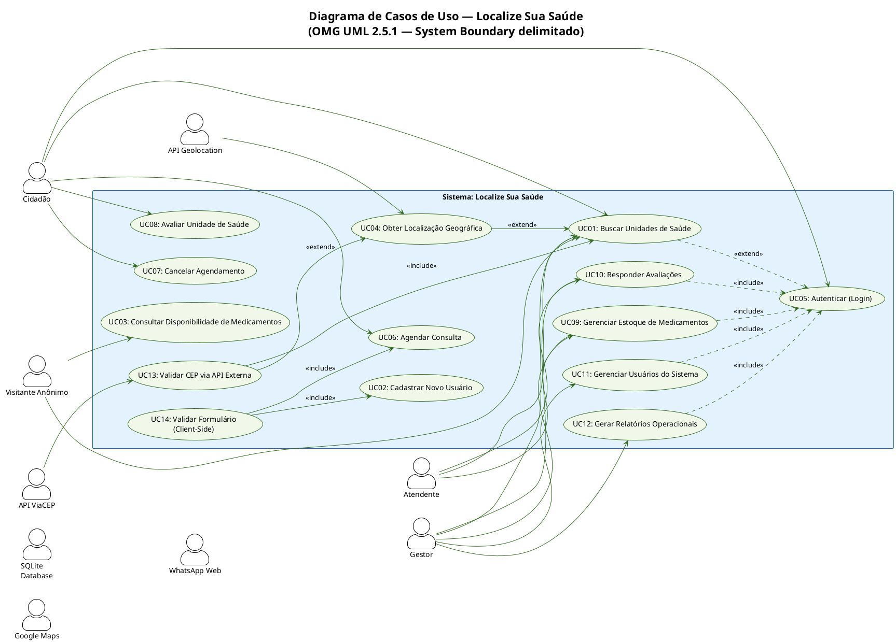
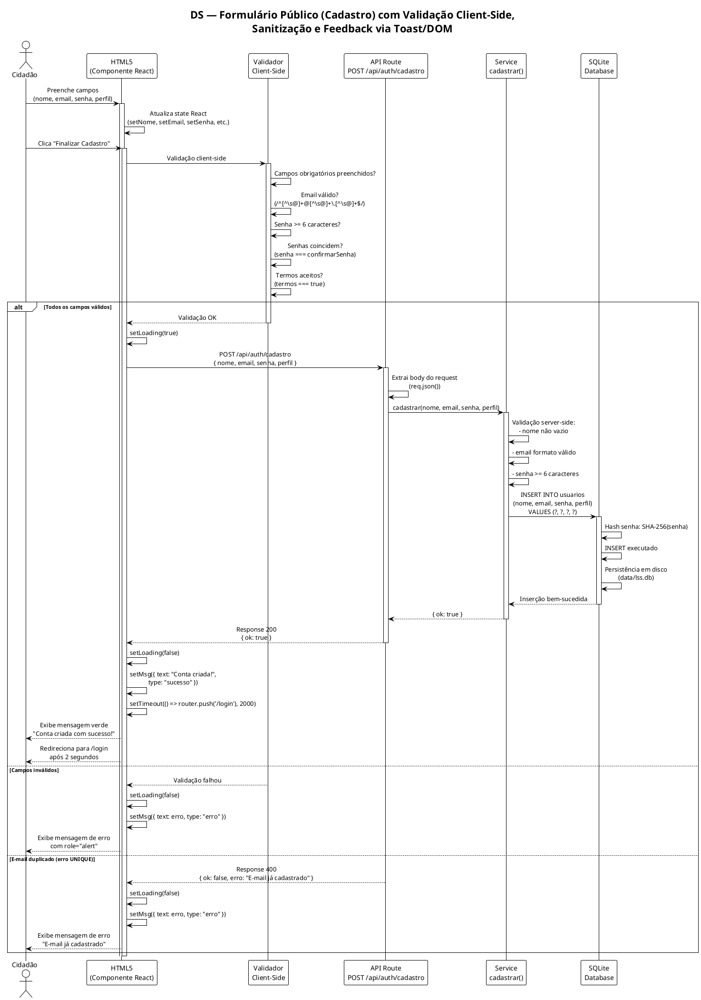
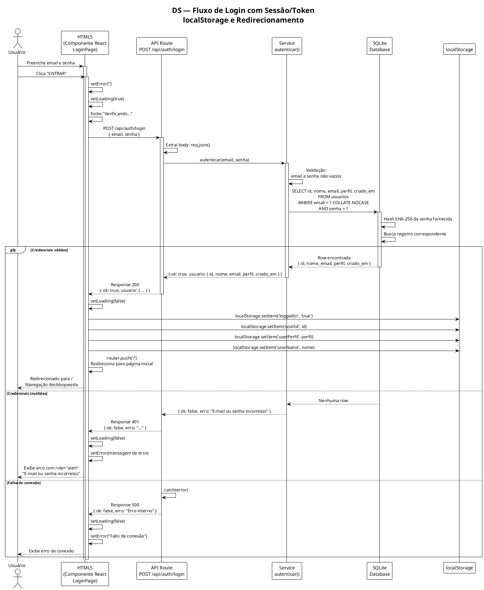
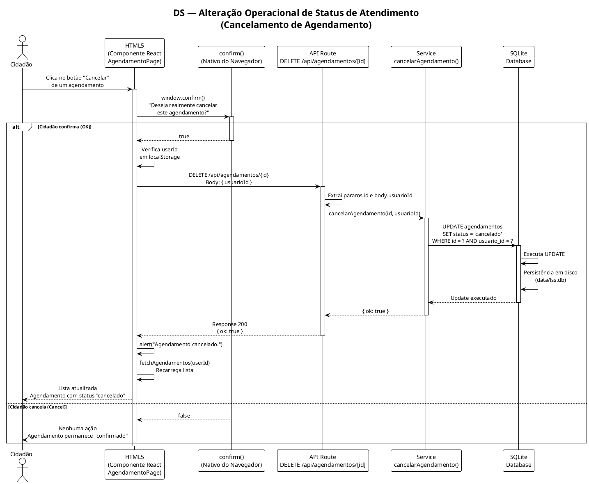
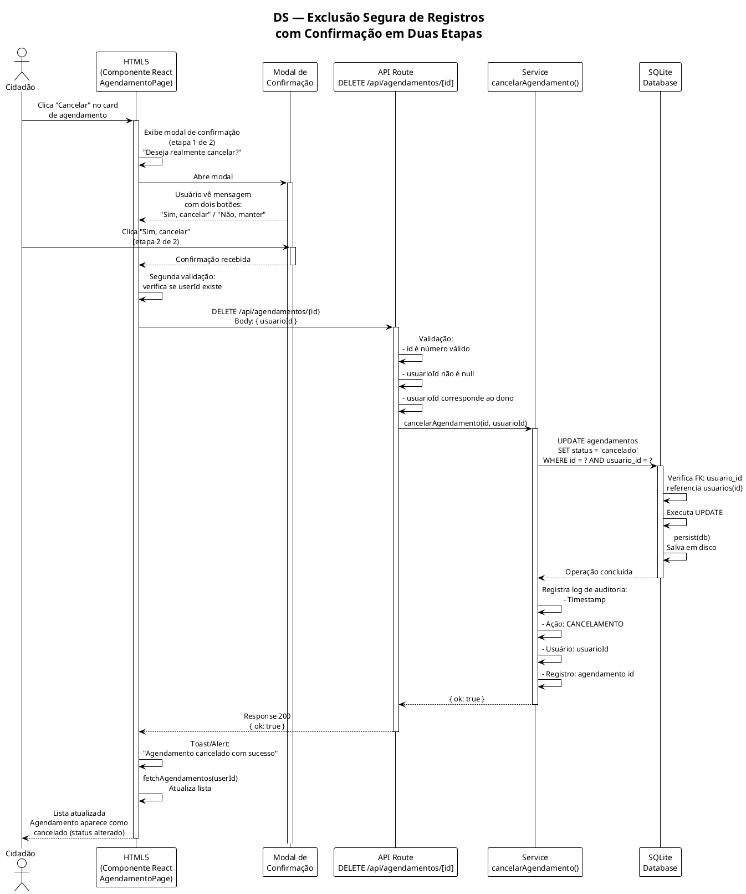

# Requisitos de Usuário — Localize Sua Saúde

**Projeto:** Localize Sua Saúde (LSS)
**Região:** Vale do Araguaia — MT/GO (Barra do Garças, Pontal do Araguaia, Aragarças)
**Versão do Documento:** 1.0.0
**Data:** 02/09/2026
**Padrões de Referência:** OMG UML 2.5.1, ISO/IEC/IEEE 29148:2018, FURPS+ / ISO/IEC 25010

---

## Sumário

1. [Identificação e Caracterização dos Atores](#1-identificação-e-caracterização-dos-atores)
2. [Diagrama de Casos de Uso](#2-diagrama-de-casos-de-uso)
3. [Catálogo de Requisitos de Usuário (RU)](#3-catálogo-de-requisitos-de-usuário-ru)
4. [Histórias de Usuário e Critérios de Aceite](#4-histórias-de-usuário-e-critérios-de-aceite)
5. [Diagramas de Sequência](#5-diagramas-de-sequência)

---

## 1. Identificação e Caracterização dos Atores

Conforme a especificação OMG UML 2.5.1 (Seção 18.1), um **ator** representa um papel que um usuário humano, um dispositivo externo ou outro sistema desempenha ao interagir com o sistema. Os atores são classificados conforme seu relacionamento com os casos de uso.

### 1.1 Atores Humanos Primários

| Identificador | Nome do Ator | Tipo UML | Descrição | Perfil de Acesso | Casos de Uso Associados |
|---|---|---|---|---|---|
| `A01` | Cidadão | Humano Primário | Usuário da população geral que busca informações sobre unidades de saúde, medicamentos e deseja agendar consultas. Acesso público a consultas; acesso autenticado a agendamentos e avaliações. | `cidadao` | UC01, UC02, UC03, UC04, UC05, UC06, UC07, UC08 |
| `A02` | Atendente | Humano Primário | Profissional de saúde ou recepcionista que gerencia a resposta a agendamentos, atualiza disponibilidade de medicamentos e responde a avaliações dos cidadãos. | `atendente` | UC01, UC02, UC03, UC05, UC06, UC07, UC08, UC09, UC10 |
| `A03` | Gestor | Humano Primário | Administrador do sistema com acesso total à gestão de usuários, relatórios, configurações e supervisão de todas as operações. | `gestor` | UC01, UC02, UC03, UC04, UC05, UC06, UC07, UC08, UC09, UC10, UC11, UC12 |

### 1.2 Atores Humanos Secundários

| Identificador | Nome do Ator | Tipo UML | Descrição | Casos de Uso Associados |
|---|---|---|---|---|
| `A04` | Visitante Anônimo | Humano Secundário | Usuário não autenticado que acessa apenas funcionalidades públicas (busca de unidades, consulta de medicamentos). | UC01, UC03, UC04 |

### 1.3 Atores Sistêmicos

| Identificador | Nome do Ator | Tipo UML | Descrição | Casos de Uso Associados |
|---|---|---|---|---|
| `A05` | API ViaCEP | Sistêmico | Serviço externo de consulta de CEP fornecido por viacep.com.br. O sistema requere dados de endereço para localização geográfica do cidadão. | UC01 |
| `A06` | API Geolocation | Sistêmico | API nativa do navegador (`navigator.geolocation`) que fornece coordenadas GPS do dispositivo do cidadão. | UC01 |
| `A07` | SQLite Database | Sistêmico | Banco de dados relacional SQLite via WebAssembly (sql.js) que persiste usuários, agendamentos e avaliações. | UC02, UC05, UC06, UC07, UC08, UC09, UC10 |
| `A08` | Google Maps | Sistêmico | Serviço externo de mapeamento utilizado para gerar links de rota até as unidades de saúde. | UC01 |
| `A09` | WhatsApp Web | Sistêmico | Serviço externo de mensagens utilizado para contato direto com as unidades de saúde. | UC01 |

---

## 2. Diagrama de Casos de Uso



### 2.1 Descrição dos Relacionamentos

#### Estereótipo `<<include>>`

| Caso de Uso Base | Caso de Uso Incluído | Justificativa |
|---|---|---|
| UC01 (Buscar Unidades) | UC13 (Validar CEP) | A busca por CEP requer obrigatoriamente a validação do CEP via API ViaCEP antes de retornar resultados georreferenciados. |
| UC06 (Agendar Consulta) | UC14 (Validar Formulário) | O agendamento exige validação client-side completa antes do envio ao servidor. |
| UC02 (Cadastrar Usuário) | UC14 (Validar Formulário) | O cadastro exige validação client-side (e-mail, senha, termos) antes do envio. |
| UC09 (Gerenciar Estoque) | UC05 (Autenticar) | A gestão de estoque requer autenticação obrigatória do atendente/gestor. |
| UC10 (Responder Avaliações) | UC05 (Autenticar) | A resposta a avaliações requer autenticação obrigatória. |
| UC11 (Gerenciar Usuários) | UC05 (Autenticar) | A administração de usuários requer autenticação com perfil gestor. |
| UC12 (Gerar Relatórios) | UC05 (Autenticar) | A geração de relatórios requer autenticação com perfil gestor. |

#### Estereótipo `<<extend>>`

| Caso de Uso Base | Caso de Uso Extensor | Condição de Extensão |
|---|---|---|
| UC01 (Buscar Unidades) | UC04 (Obter Localização) | Quando o cidadão opta por usar a geolocalização do navegador em vez de buscar por filtros textuais. |
| UC04 (Obter Localização) | UC13 (Validar CEP) | Quando a geolocalização falha e o sistema extende o fluxo para solicitar o CEP como alternativa. |
| UC01 (Buscar Unidades) | UC05 (Autenticar) | Quando o cidadão deseja acessar funcionalidades restritas a partir da busca (avaliar, agendar). |

---

## 3. Catálogo de Requisitos de Usuário (RU)

### 3.1 RU-001: Busca de Unidades de Saúde por Filtros

| Campo | Valor |
|---|---|
| **Identificador** | RU-001 |
| **Caso de Uso Associado** | UC01 |
| **Ator Principal** | Cidadão (A01) / Visitante Anônimo (A04) |
| **Prioridade (MoSCoW)** | **Must** |
| **Pré-condições** | 1. O navegador do cidadão está acessível. 2. A página inicial (`/`) está carregada com sucesso. |
| **Fluxo Operacional** | 1. O cidadão acessa a página inicial do sistema. 2. O cidadão visualiza a barra de busca principal com o campo de texto. 3. O cidadão digita termos de busca (nome, especialidade ou cidade) no campo `#search-input`. 4. O cidadão seleciona filtros opcionais: Cidade (`#filter-city`), Tipo (`#filter-type`), Atendimento (`#filter-atendimento`), Especialidade (`#filter-especialidade`). 5. O cidadão clica no botão "Buscar" ou pressiona Enter. 6. O sistema monta os parâmetros de query string (`q`, `cidade`, `tipo`, `atendimento`, `especialidade`). 7. O sistema redireciona para a rota `/hospitais` com os parâmetros na URL. 8. A página `/hospitais` renderiza a lista filtrada de unidades de saúde. |
| **Pós-condições** | 1. A lista de unidades de saúde é exibida com os filtros aplicados. 2. A URL reflete os filtros selecionados (bookmarkável). |

### 3.2 RU-002: Busca de Unidades por CEP

| Campo | Valor |
|---|---|
| **Identificador** | RU-002 |
| **Caso de Uso Associado** | UC01, UC13 |
| **Ator Principal** | Cidadão (A01) / Visitante Anônimo (A04) |
| **Prioridade (MoSCoW)** | **Must** |
| **Pré-condições** | 1. A página inicial está carregada. 2. Conexão com a internet disponível para consulta à API ViaCEP. |
| **Fluxo Operacional** | 1. O cidadão localiza o campo de CEP na linha `.cep-row`. 2. O cidadão digita o CEP com 8 dígitos (campo `#cep-input`, `maxLength=9`). 3. O cidadão clica no botão "Buscar por CEP". 4. O sistema remove caracteres não numéricos com regex `/\D/g`. 5. O sistema valida se o CEP possui exatamente 8 dígitos. 6. O sistema emite `fetch()` para `https://viacep.com.br/ws/{cep}/json/`. 7. O sistema verifica se a resposta contém `erro: true`. 8. Se válido, o sistema exibe o endereço: `{logradouro}, {localidade} - {uf}`. 9. O sistema redireciona para `/hospitais?cep={cep}&cidade={localidade}`. |
| **Pós-condições** | 1. O cidadão é redirecionado para a página de hospitais com filtros geográficos. 2. Mensagens de erro são exibidas via `#location-status` com `aria-live="polite"`. |

### 3.3 RU-003: Busca por Geolocalização GPS

| Campo | Valor |
|---|---|
| **Identificador** | RU-003 |
| **Caso de Uso Associado** | UC04 |
| **Ator Principal** | Cidadão (A01) / Visitante Anônimo (A04) |
| **Prioridade (MoSCoW)** | **Should** |
| **Pré-condições** | 1. O navegador suporta `navigator.geolocation`. 2. O cidadão autorizou o acesso à localização. |
| **Fluxo Operacional** | 1. O cidadão clica no botão "Usar minha localização" (`#btn-geoloc`). 2. O sistema exibe "Obtendo sua localização...". 3. O sistema invoca `navigator.geolocation.getCurrentPosition()`. 4. Em caso de sucesso: extrai `latitude` e `longitude` com `toFixed(5)`. 5. O sistema exibe mensagem de sucesso com coordenadas. 6. O sistema redireciona para `/hospitais?lat={lat}&lon={lon}`. 7. Em caso de falha: exibe mensagem sugerindo informar o CEP. |
| **Pós-condições** | 1. O cidadão é redirecionado para hospitais próximos com coordenadas GPS. 2. Fallback para CEP é oferecido em caso de falha. |

### 3.4 RU-004: Criação de Conta (Cadastro)

| Campo | Valor |
|---|---|
| **Identificador** | RU-004 |
| **Caso de Uso Associado** | UC02, UC14 |
| **Ator Principal** | Cidadão (A01) |
| **Prioridade (MoSCoW)** | **Must** |
| **Pré-condições** | 1. O cidadão não possui conta no sistema. 2. A página `/cadastro` está acessível. |
| **Fluxo Operacional** | 1. O cidadão acessa `/cadastro` a partir do link "Não tem conta? Cadastre-se gratuitamente". 2. O cidadão preenche: Nome Completo (`#nome`), E-mail (`#email`), Perfil de Acesso (`#perfil` — opções: Cidadão, Atendente, Gestor), Senha (`#senha`, mín. 6 caracteres), Confirmar Senha (`#confirmar_senha`). 3. O cidadão ativa o checkbox de aceitação dos termos e condições. 4. O cidadão clica em "Finalizar Cadastro". 5. O sistema valida client-side: campos obrigatórios, formato de e-mail (`/^[^\s@]+@[^\s@]+\.[^\s@]+$/`), senhas coincidentes, termos aceitos. 6. O sistema envia `POST /api/auth/cadastro` com payload `{ nome, email, senha, perfil }`. 7. O backend valida: nome não vazio, e-mail válido, senha ≥ 6 caracteres, e-mail único. 8. Em caso de sucesso: exibe mensagem verde "Conta criada com sucesso!" e redireciona para `/login` após 2 segundos. 9. Em caso de falha: exibe mensagem de erro com `role="alert"`. |
| **Pós-condições** | 1. Novo usuário inserido na tabela `usuarios` com senha hasheada (SHA-256). 2. Cidadão redirecionado para a página de login. |

### 3.5 RU-005: Autenticação (Login)

| Campo | Valor |
|---|---|
| **Identificador** | RU-005 |
| **Caso de Uso Associado** | UC05 |
| **Ator Principal** | Cidadão (A01), Atendente (A02), Gestor (A03) |
| **Prioridade (MoSCoW)** | **Must** |
| **Pré-condições** | 1. O usuário possui conta cadastrada. 2. A página `/login` está acessível. |
| **Fluxo Operacional** | 1. O usuário acessa `/login`. 2. O usuário preenche: E-mail ou Usuário (`#user`), Senha (`#pass`). 3. O usuário pode alternar visibilidade da senha (botão "Mostrar/Ocultar senha"). 4. O usuário clica em "ENTRAR". 5. O sistema envia `POST /api/auth/login` com payload `{ email, senha }`. 6. O backend busca o usuário pelo e-mail (case-insensitive via `COLLATE NOCASE`) e compara o hash SHA-256 da senha. 7. Em caso de sucesso: o backend retorna `{ ok: true, usuario: { id, nome, email, perfil, criado_em } }`. 8. O frontend armazena no `localStorage`: `loggedIn=true`, `userId`, `userPerfil`, `userName`. 9. O sistema redireciona para `/` (página inicial). 10. Em caso de falha: exibe mensagem de erro com `role="alert"`. |
| **Pós-condições** | 1. Sessão do cidadão estabelecida via `localStorage`. 2. Navegação desbloqueada para funcionalidades autenticadas (agendar, avaliar). |

### 3.6 RU-006: Agendamento de Consulta

| Campo | Valor |
|---|---|
| **Identificador** | RU-006 |
| **Caso de Uso Associado** | UC06, UC14 |
| **Ator Principal** | Cidadão (A01) |
| **Prioridade (MoSCoW)** | **Must** |
| **Pré-condições** | 1. O cidadão está autenticado (`localStorage.loggedIn === 'true'`). 2. A página `/agendamento` está acessível. |
| **Fluxo Operacional** | 1. O cidadão acessa `/agendamento`. 2. Se não autenticado, o sistema exibe aviso com links para Login e Cadastro. 3. O cidadão seleciona a Unidade de Saúde (`#sched-unit` — Medbarra, UPA 24h, Hospital Cristo Redentor). 4. O cidadão seleciona a Especialidade (`#sched-spec` — Clínico Geral, Cardiologia, Ortopedia, Pediatria, Ginecologia, Neurologia). 5. O cidadão seleciona a Data da Consulta (`#sched-date`, com `min` = data atual). 6. O cidadão preenche: Nome do Paciente (`#sched-patient`), CPF (`#sched-cpf`, opcional), Telefone/WhatsApp (`#sched-phone`, opcional). 7. O sistema exibe os horários disponíveis para a unidade e data selecionadas (slots estáticos do frontend). 8. O cidadão seleciona um horário disponível. 9. O cidadão opcionalmente preenche Observações (`#sched-notes`). 10. O cidadão clica em "Confirmar Agendamento". 11. O sistema envia `POST /api/agendamentos` com payload `{ usuarioId, unidade, especialidade, data, horario, paciente, cpf, telefone, observacoes }`. 12. O backend insere o agendamento com `status = 'confirmado'`. 13. Em caso de sucesso: exibe `alert()` com confirmação e atualiza a lista de agendamentos do usuário. |
| **Pós-condições** | 1. Novo registro inserido na tabela `agendamentos`. 2. O agendamento aparece na seção "Meus Agendamentos" do cidadão. |

### 3.7 RU-007: Cancelamento de Agendamento

| Campo | Valor |
|---|---|
| **Identificador** | RU-007 |
| **Caso de Uso Associado** | UC07 |
| **Ator Principal** | Cidadão (A01) |
| **Prioridade (MoSCoW)** | **Must** |
| **Pré-condições** | 1. O cidadão está autenticado. 2. Possui ao menos um agendamento com status `confirmado`. |
| **Fluxo Operacional** | 1. O cidadão visualiza a lista "Meus Agendamentos". 2. O cidadão clica no botão "Cancelar" (`btn-cancel`) de um agendamento. 3. O sistema exibe `confirm()` nativo do navegador: "Deseja realmente cancelar este agendamento?". 4. Se o cidadão confirma: o sistema envia `DELETE /api/agendamentos/{id}` com body `{ usuarioId }`. 5. O backend executa `UPDATE agendamentos SET status = 'cancelado' WHERE id = ? AND usuario_id = ?`. 6. Em caso de sucesso: exibe `alert("Agendamento cancelado.")`. 7. O sistema atualiza a lista de agendamentos. |
| **Pós-condições** | 1. O status do agendamento é alterado de `confirmado` para `cancelado`. 2. O agendamento permanece no banco de dados com status alterado (soft delete). |

### 3.8 RU-008: Avaliação de Unidade de Saúde

| Campo | Valor |
|---|---|
| **Identificador** | RU-008 |
| **Caso de Uso Associado** | UC08 |
| **Ator Principal** | Cidadão (A01) |
| **Prioridade (MoSCoW)** | **Should** |
| **Pré-condições** | 1. O cidadão está autenticado. 2. A página `/hospitais` está carregada com ao menos uma unidade visível. |
| **Fluxo Operacional** | 1. O cidadão expande a seção "Avaliar esta unidade" no card da unidade (`<details>`). 2. O cidadão seleciona uma nota de 1 a 5 estrelas (botões interativos). 3. O cidadão opcionalmente escreve um comentário no `<textarea>`. 4. O cidadão clica em "Enviar avaliação". 5. O sistema verifica autenticação via `localStorage`. 6. Se não autenticado: exibe `alert()` solicitando login. 7. Se autenticado e nota selecionada: envia `POST /api/avaliacoes` com payload `{ usuarioId, unidadeId, nota, comentario }`. 8. O backend valida: `nota BETWEEN 1 AND 5` (constraint CHECK). 9. Em caso de sucesso: exibe `alert()` com confirmação. |
| **Pós-condições** | 1. Nova avaliação inserida na tabela `avaliacoes`. 2. A avaliação é persistida com `criado_em` automático. |

### 3.9 RU-009: Consulta de Disponibilidade de Medicamentos

| Campo | Valor |
|---|---|
| **Identificador** | RU-009 |
| **Caso de Uso Associado** | UC03 |
| **Ator Principal** | Cidadão (A01) / Visitante Anônimo (A04) |
| **Prioridade (MoSCoW)** | **Must** |
| **Pré-condições** | 1. A página `/medicamentos` está carregada. |
| **Fluxo Operacional** | 1. O cidadão acessa `/medicamentos`. 2. O cidadão digita o nome do medicamento no campo de busca (`#med-input`). 3. O cidadão clica em "Buscar" ou pressiona Enter. 4. O sistema busca no banco de dados estático `medsDatabase` por correspondência parcial (case-insensitive). 5. O sistema exibe cards de resultado para cada unidade de saúde: status (Disponível / Sem estoque), nome da unidade, tipo (SUS/Particular), data/hora da última atualização. 6. Se nenhum resultado encontrado: exibe mensagem com sugestão de tentar outro nome. 7. O cidadão pode usar atalhos de busca comum: Dipirona, Amoxicilina, Losartana, Metformina, Omeprazol. |
| **Pós-condições** | 1. Resultados exibidos com informações de disponibilidade por unidade. 2. Disclaimer de confirmação por telefone exibido. |

### 3.10 RU-010: Gerenciamento de Estoque de Medicamentos (Atendente/Gestor)

| Campo | Valor |
|---|---|
| **Identificador** | RU-010 |
| **Caso de Uso Associado** | UC09 |
| **Ator Principal** | Atendente (A02) / Gestor (A03) |
| **Prioridade (MoSCoW)** | **Could** |
| **Pré-condições** | 1. O atendente/gestor está autenticado com perfil adequado. |
| **Fluxo Operacional** | 1. O atendente acessa a área administrativa. 2. O atendente seleciona a unidade de saúde que gerencia. 3. O atendente cadastra ou atualiza medicamentos: nome, quantidade disponível, data/hora da atualização. 4. O sistema valida os dados e persiste no banco. 5. As atualizações são refletidas imediatamente na consulta pública de medicamentos. |
| **Pós-condições** | 1. Dados de estoque atualizados na tabela `medicamentos`. 2. Consultas públicas refletem os dados atualizados. |

### 3.11 RU-011: Gerenciamento de Usuários (Gestor)

| Campo | Valor |
|---|---|
| **Identificador** | RU-011 |
| **Caso de Uso Associado** | UC11 |
| **Ator Principal** | Gestor (A03) |
| **Prioridade (MoSCoW)** | **Could** |
| **Pré-condições** | 1. O gestor está autenticado com perfil `gestor`. |
| **Fluxo Operacional** | 1. O gestor acessa o painel administrativo. 2. O gestor visualiza a lista de todos os usuários cadastrados. 3. O gestor pode alterar perfis de acesso (cidadao, atendente, gestor). 4. O gestor pode desativar usuários. 5. O gestor pode visualizar logs de atividades. |
| **Pós-condições** | 1. Alterações de perfil refletidas na tabela `usuarios`. 2. Usuários desativados não conseguem autenticar. |

### 3.12 RU-012: Acessibilidade e Modo Idoso

| Campo | Valor |
|---|---|
| **Identificador** | RU-012 |
| **Caso de Uso Associado** | Transversal |
| **Ator Principal** | Cidadão (A01) |
| **Prioridade (MoSCoW)** | **Must** |
| **Pré-condições** | 1. Qualquer página do sistema está carregada. |
| **Fluxo Operacional** | 1. O cidadão visualiza a barra de acessibilidade (`#accessibility-bar`) no topo de todas as páginas. 2. O cidadão pode ativar/desativar "Modo Idoso" (aumenta tamanho de fonte e elementos interativos). 3. O cidadão pode ativar/desativar "Alto Contraste" (muda esquema de cores para maior legibilidade). 4. O cidadão pode aumentar/diminuir o tamanho da fonte (A+/A-) com incrementos de 2px. 5. As preferências são persistidas em `localStorage` e restauradas no carregamento. |
| **Pós-condições** | 1. Preferências de acessibilidade aplicadas via classes CSS no `<body>` e `<html>`. 2. Configurações preservadas entre sessões. |

---

## 4. Histórias de Usuário e Critérios de Aceite

### 4.1 HU-001: Busca de Unidades de Saúde

**Como** cidadão do Vale do Araguaia,
**Eu quero** buscar unidades de saúde por nome, especialidade ou cidade,
**Para que** eu encontre rapidamente a unidade que atende minhas necessidades.

**Critérios de Aceite (BDD / Gherkin):**

```gherkin
Funcionalidade: Busca de Unidades de Saúde
  Cenário: Busca textual por termo
    Dado que o cidadão está na página inicial
    E a barra de busca está visível
    Quando o cidadão digita "Cardiologia" no campo de busca
    E clica no botão "Buscar"
    Então o sistema redireciona para /hospitais?q=Cardiologia
    E a lista de unidades é filtrada por especialidade "Cardiologia"

  Cenário: Busca com filtro de cidade
    Dado que o cidadão está na página inicial
    Quando o cidadão seleciona "Barra do Garças" no filtro de cidade
    E clica no botão "Buscar"
    Then o sistema redireciona para /hospitais?cidade=barra
    E apenas unidades de Barra do Garças são exibidas

  Cenário: Busca combinando múltiplos filtros
    Dado que o cidadão está na página inicial
    Quando o cidadão seleciona cidade "Pontal do Araguaia"
    E tipo "Hospital"
    E atendimento "Público / SUS"
    E clica em "Buscar"
    E o sistema aplica todos os filtros simultaneamente
    E apenas unidades que atendem todos os critérios são exibidas
```

### 4.2 HU-002: Busca por CEP

**Como** cidadão sem acesso a GPS,
**Eu quero** informar meu CEP para encontrar unidades próximas,
**Para que** eu saiba quais unidades atendem minha região.

**Critérios de Aceite (BDD / Gherkin):**

```gherkin
Funcionalidade: Busca por CEP
  Cenário: CEP válido retorna endereço
    Dado que o cidadão está na página inicial
    Quando o cidadão digita "78620000" no campo de CEP
    E clica em "Buscar por CEP"
    Então o sistema consulta a API ViaCEP
    E exibe o endereço completo retornado
    E redireciona para /hospitais com parâmetros cep e cidade

  Cenário: CEP com formato inválido
    Dado que o cidadão está na página inicial
    Quando o cidadão digita "123" no campo de CEP
    E clica em "Buscar por CEP"
    Então o sistema exibe mensagem "Digite um CEP válido com 8 dígitos"
    E não realiza consulta à API

  Cenário: CEP inexistente
    Dado que o cidadão está na página inicial
    Quando o cidadão digita "00000000" no campo de CEP
    E clica em "Buscar por CEP"
    Então a API ViaCEP retorna erro
    E o sistema exibe "CEP não encontrado"
```

### 4.3 HU-003: Cadastro de Novo Usuário

**Como** cidadão que deseja usar funcionalidades autenticadas,
**Eu quero** criar uma conta gratuita,
**Para que** eu possa agendar consultas e avaliar unidades.

**Critérios de Aceite (BDD / Gherkin):**

```gherkin
Funcionalidade: Cadastro de Usuário
  Cenário: Cadastro bem-sucedido
    Dado que o cidadão está na página /cadastro
    Quando o cidadão preenche nome "João Silva"
    E email "joao@email.com"
    E perfil "Cidadão"
    E senha "minhasenhasegura"
    E confirma senha "minhasenhasegura"
    E aceita os termos e condições
    E clica em "Finalizar Cadastro"
    Então o sistema envia POST /api/auth/cadastro
    E o usuário é criado no banco com senha hasheada
    E mensagem de sucesso é exibida
    E o cidadão é redirecionado para /login após 2 segundos

  Cenário: Senhas não coincidem
    Dado que o cidadão está na página /cadastro
    Quando o cidadão preenche senha "abc123"
    E confirma senha "xyz789"
    E clica em "Finalizar Cadastro"
    Então o sistema exibe erro "As senhas não conferem"
    E nenhum request é enviado ao servidor

  Cenário: E-mail já cadastrado
    Dado que o email "cidadao@teste.com" já existe no banco
    Quando o cidadão tenta cadastrar com esse email
    Então o backend retorna erro 400
    E o sistema exibe "Este e-mail já está cadastrado"

  Cenário: Termos não aceitos
    Dado que o cidadão preencheu todos os campos corretamente
    Quando o cidadão não marca o checkbox de termos
    E clica em "Finalizar Cadastro"
    Então o sistema exibe "Você precisa aceitar os termos e condições"
```

### 4.4 HU-004: Login e Autenticação

**Como** usuário registrado,
**Eu quero** fazer login com meu e-mail e senha,
**Para que** eu acesse funcionalidades restritas.

**Critérios de Aceite (BDD / Gherkin):**

```gherkin
Funcionalidade: Autenticación de Usuário
  Cenário: Login bem-sucedido
    Dado que o usuário está na página /login
    Quando o usuário preenche email "cidadao@teste.com"
    E senha "123456"
    E clica em "ENTRAR"
    Então o sistema envia POST /api/auth/login
    E o backend retorna { ok: true, usuario: { id, nome, perfil } }
    E localStorage armazena loggedIn=true, userId, userPerfil, userName
    E o usuário é redirecionado para /

  Cenário: Credenciais inválidas
    Dado que o usuário está na página /login
    Quando o usuário preenche email "invalido@teste.com"
    E senha "senhaerrada"
    E clica em "ENTRAR"
    Então o backend retorna erro 401
    E o sistema exibe "E-mail ou senha incorretos"

  Cenário: Toggle visibilidade da senha
    Dado que o usuário está na página /login
    Quando o usuário clica em "Mostrar senha"
    Entao o campo de senha muda type para "text"
    E o texto do botão muda para "Ocultar senha"
```

### 4.5 HU-005: Agendamento de Consulta

**Como** cidadão autenticado,
**Eu quero** agendar uma consulta em uma unidade de saúde,
**Para que** eu consiga ser atendido em um horário específico.

**Critérios de Aceite (BDD / Gherkin):**

```gherkin
Funcionalidade: Agendamento de Consulta
  Cenário: Agendamento bem-sucedido
    Dado que o cidadão está autenticado
    E está na página /agendamento
    Quando seleciona unidade "Medbarra"
    E especialidade "Cardiologia"
    E data "2026-09-15"
    E nome do paciente "Maria da Silva"
    E horário "10:00"
    E clica em "Confirmar Agendamento"
    Então o sistema envia POST /api/agendamentos
    E o agendamento é criado com status "confirmado"
    E o cidadão visualiza confirmação
    E o agendamento aparece na lista "Meus Agendamentos"

  Cenário: Tentativa de agendamento sem login
    Dado que o cidadão NÃO está autenticado
    E está na página /agendamento
    Quando o cidadão preenche o formulário e clica em "Confirmar Agendamento"
    Então o sistema exibe "Para agendar uma consulta você precisa estar logado"
    E nenhum request é enviado ao servidor

  Cenário: Campos obrigatórios não preenchidos
    Dado que o cidadão está autenticado
    Quando o cidadão não preenche a unidade
    E clica em "Confirmar Agendamento"
    Então o sistema exibe "Preencha todos os campos e selecione um horário disponível"

  Cenário: UPA selecionada (sem agendamento)
    Dado que o cidadão seleciona "UPA 24h"
    Então o sistema exibe mensagem "A UPA 24h atende por demanda espontânea — não é necessário agendamento"
    E nenhum horário disponível é exibido
```

### 4.6 HU-006: Cancelamento de Agendamento

**Como** cidadão com agendamento ativo,
**Eu quero** cancelar um agendamento,
**Para que** eu libere o horário para outros pacientes.

**Critérios de Aceite (BDD / Gherkin):**

```gherkin
Funcionalidade: Cancelamento de Agendamento
  Cenário: Cancelamento confirmado
    Dado que o cidadão tem um agendamento com status "confirmado"
    Quando o cidadão clica no botão "Cancelar"
    E confirma no diálogo de confirmação
    Então o sistema envia DELETE /api/agendamentos/{id}
    E o status do agendamento é alterado para "cancelado"
    E a lista de agendamentos é atualizada

  Cenário: Cancelamento recusado
    Dado que o cidadão tem um agendamento ativo
    Quando o cidadão clica no botão "Cancelar"
    E NÃO confirma no diálogo de confirmação
    Então nenhum request é enviado ao servidor
    E o agendamento permanece com status "confirmado"
```

### 4.7 HU-007: Avaliação de Unidade de Saúde

**Como** cidadão autenticado,
**Eu quero** avaliar uma unidade de saúde com nota e comentário,
**Para que** eu contribua com a comunidade sobre a qualidade do serviço.

**Critérios de Aceite (BDD / Gherkin):**

```gherkin
Funcionalidade: Avaliação de Unidade
  Cenário: Avaliação bem-sucedida
    Dado que o cidadão está autenticado
    E está na página /hospitais
    Quando expande "Avaliar esta unidade"
    E seleciona 4 estrelas
    E escreve "Ótimo atendimento, equipe competente"
    E clica em "Enviar avaliação"
    Então o sistema envia POST /api/avaliacoes
    E a avaliação é persistida com nota=4
    E o cidadão visualiza confirmação

  Cenário: Avaliação sem nota
    Dado que o cidadão está autenticado
    Quando expande "Avaliar esta unidade"
    E NÃO seleciona nenhuma estrela
    E clica em "Enviar avaliação"
    Então o sistema exibe "Por favor, selecione uma nota de 1 a 5 estrelas"
```

### 4.8 HU-008: Consulta de Medicamentos

**Como** cidadão,
**Eu quero** verificar a disponibilidade de medicamentos nas unidades de saúde,
**Para que** eu saiba onde encontrar o medicamento que preciso.

**Critérios de Aceite (BDD / Gherkin):**

```gherkin
Funcionalidade: Consulta de Medicamentos
  Cenário: Medicamento encontrado
    Dado que o cidadão está na página /medicamentos
    Quando digita "Dipirona" no campo de busca
    E clica em "Buscar"
    Então o sistema exibe cards para cada unidade
    E cada card mostra status (Disponível/Sem estoque)
    E cada card mostra unidade, tipo e data de atualização

  Cenário: Medicamento não encontrado
    Dado que o cidadão está na página /medicamentos
    Quando digita "MedicamentoInexistente"
    E clica em "Buscar"
    Então o sistema exibe "Nenhum resultado para 'MedicamentoInexistente'"
    E sugere tentar outro nome

  Cenário: Busca rápida por atalho
    Dado que o cidadão está na página /medicamentos
    Quando clica no chip "Losartana"
    Então o campo de busca é preenchido automaticamente
    E os resultados são exibidos imediatamente
```

---

## 5. Diagramas de Sequência

### 5.1 Diagrama de Sequência: Formulário Público com Validação Client-Side



### 5.2 Diagrama de Sequência: Fluxo de Login Administrativo



### 5.3 Diagrama de Sequência: Alteração de Status de Atendimento



### 5.4 Diagrama de Sequência: Exclusão Segura com Diálogo Modal



---

**Fim do Documento — Requisitos de Usuário v1.0.0**
